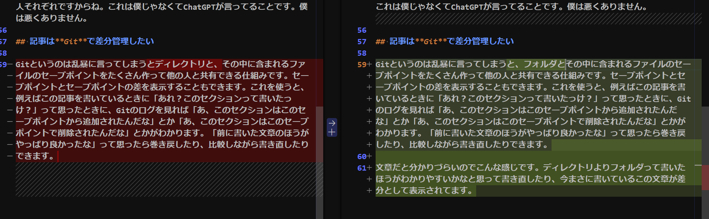
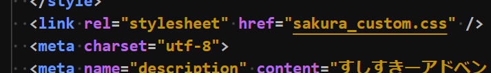
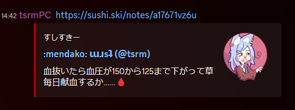
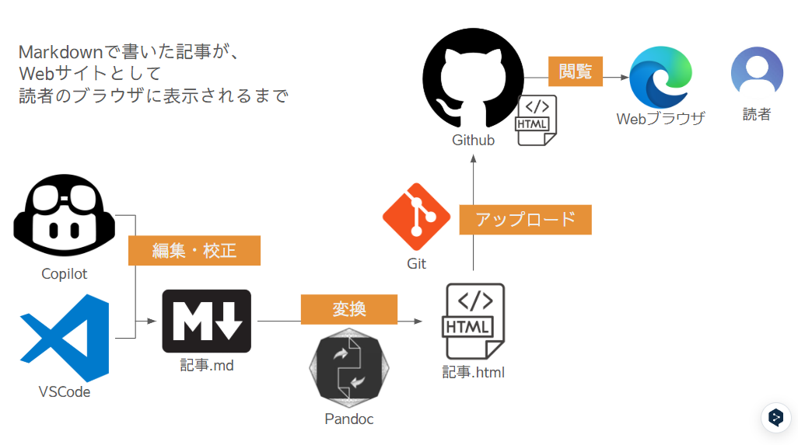
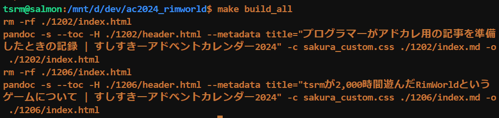
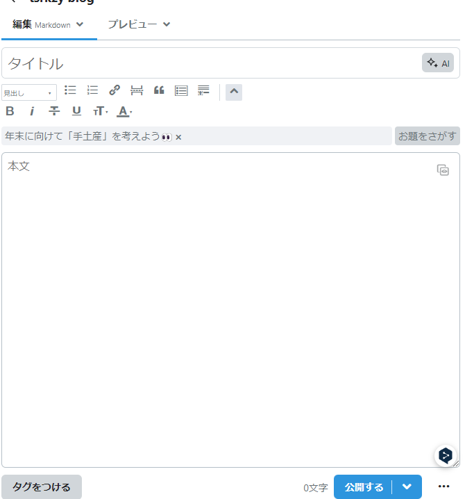

# はじめに

こんにちは[tsrm](https://sushi.ski/@tsrm)です。この記事はすしすきーアドベントカレンダー2024 Vol3 12/02として寄稿させてもらった記事です。自己紹介をさせてもらいつつ記事の内容を簡単に説明します。

## tsrm

絵を描いて面白おかしく暮らしている狼耳の美少女です。満月の夜だけ小汚いプログラマのおっさんゲーマーになります。得意なことはJavaScriptでフロントエンドのコード書いたりDockerで開発環境作ったりなんですが、今はGolangでバッチ書いてたりAWS CDKでインフラ構築してたりします。要するに何でも屋の雑用係です。趣味はお絵描きとゲームです。よろしくお願いします。

## この記事について

そんなプログラマーが12/06にアドカレの枠を何も考えずに取ってテキストを書き始めたところ、これはどうやらゲームについての長文記事を書くことになりそうだぞ、`.TXT`形式で記事を書いたらどこのブログサービスを使うにしろマークアップが大変なことになるぞ、ということに気づき、とりあえずMarkdown形式でファイルを作ってマークアップし、Gitで差分管理できるようにして文章校正を楽にし、HTMLにコンバートしたファイルをGithub経由で外部公開できる仕組みを最初に作っておかないと締切に間に合わないわ校正は大変だわ公開するサービスを決めたらそのサービスの仕様に合わせてマークアップを修正しないといけないわで大変だわ、ということでそういう構成をふわっと考えて実装したときの顛末をVol3の12/02が空いていたので記事にしてねじ込んだものです。

つまりこの記事を書いているのは12/06分の記事を11/30に書き終わって校正を済ませて賢者モードになっているプログラマーであり、この記事はその**プログラマーが12/06に書いた記事をどうやって管理してどうやって公開したのかを説明する記事**ってことです。わかりやすいですね。

最初に断っておくと、この記事はプログラマーがプログラマーのために書いた記事です。プログラマー以外の人にはあまり面白くないかもしれません。でもプログラマーには面白いかもしれません。プログラマーの人は読んでみてください。プログラマー以外の人は読まなくてもいいです。でも読んでもいいです。読んでくれたら嬉しいです。この段落のここまではVSCodeに**「最初に断っておくと」って入力したらCopilotっていうAIが考えてくれました**。便利ですねVSCode Copilot。めちゃくちゃ便利なので仕事でソースコードをはじめ文章を扱う人達はぜひ使って課金してください。VSCodeもCopilotもMicrosoftのツールとしては珍しく使いやすいものなので正直びっくりしてる。

# 要件整理

1. 記事は`Markdown`形式で書きたい
2. 記事は**Git**で差分管理したい
3. できればCSSとかも使って見栄えを良くしたい
4. あとmetaタグいじってOGP対応したい
5. 出来上がったHTMLとCSSを気軽にWebサイトとして公開したい

プログラマー以外の人にもわかるように、順番に要件について説明していきます。

## 記事はMarkdown形式で書きたい

`.TXT`形式っていうのは皆さんPCでメモ帳つかってテキストファイルを作ったことがあるかと思いますがそれのことです。ただの文字列であり、ただの文字列以上でも文字列以下でもありません。こういった文字数稼ぎはChatGPTが真っ先に「冗長だから削れ」って指摘してくるんですが、普段冗長でないソースコードを仕事で書いている反動なのか、こういう文章を書くときにはついつい冗長にしてしまいがちです。そういうわけでChatGPTには「これは僕の芸風だから校正の対象から外せ」って調教しておきました。ChatGPTはAIなのでちゃんと調教すれば人間の言うことを聞いてくれます。AIにも教育が必要です。グフフ……僕好みに教育してやるぜ。こういうネタは書いて良いんですか？書かないほうが良いですか？それはそうですね。**Markdown形式のテキストファイルって何？って話に戻ります。**

対してMarkdownというのは拡張子が`.md`というファイルのことで、例えばひとつ前のセクション冒頭はこんな感じに書くことができます。

```markdown
# 要件整理

1. 記事は`Markdown`形式で書きたい
2. 記事は**Git**で差分管理したい
3. できればCSSとかも使って見栄えを良くしたい
4. あとmetaタグいじってOGP対応したい
5. 出来上がったHTMLとCSSを気軽にWebサイトとして公開したい
```

これをHTMLに変換するとこうなります。

```html
<h1>要件整理</h1>
<ol>
  <li>記事は<code>Markdown</code>形式で書きたい</li>
  <li>記事は<strong>Git</strong>で差分管理したい</li>
  <li>できればCSSとかも使って見栄えを良くしたい</li>
  <li>あとmetaタグいじってOGP対応したい</li>
  <li>出来上がったHTMLとCSSを気軽にWebサイトとして公開したい</li>
</ol>
```
それをブラウザで見るとさっきみたいな形式で表示できるってわけですね。HTMLを直接書くよりも文字数が減らせるし、見やすいし書きやすいので便利です。Textileとかいろいろあるんですが、Markdownが一番シンプルで気に入っているので今回はMarkdownを使います。

> MisskyのMFMとかも大別するとこれらの仲間でマークアップ言語といいます。テキストだけで記述する、テキストをおしゃれに(マークアップ)するための言語です。
> HTMLもマークアップ言語だったりします。気になる人はググってください。

## 記事はGitで差分管理したい

Gitというのは乱暴に言ってしまうと、フォルダとその中に含まれるファイルのセーブポイントをたくさん作って他の人と共有できる仕組みです。セーブポイントとセーブポイントの差を表示することもできます。これを使うと、例えばこの記事を書いているときに「あれ？このセクションって書いたっけ？」って思ったときに、Gitのログを見れば「あ、このセクションはこのセーブポイントから追加されたんだな」とか「あ、このセクションはこのセーブポイントで削除されたんだな」とかがわかります。「前に書いた文章のほうがやっぱり良かったな」って思ったら簡単に巻き戻したり、比較しながら書き直したりできます。**「【令和最新版】☆修正中_新しい作成中のアドカレ記事のコピー(2) (4)のバックアップのコピー」**といったNastyなファイルを作らなくて良くなります。

文章だとできることが分かりづらいのでスクショで説明するとこんな感じです。暗い赤が変更があった行、明るい赤が削除された文字列、暗い緑が変更があった行、明るい緑が追加された文字列です。



## できればCSSとかも使って見栄えを良くしたい

Markdownで書いた記事をHTMLに変換すると、見た目がシンプルすぎてちょっと物足りないです。黒文字に白背景、ボタンは灰色の例の見た目になります。このページには別に記述したスタイルシートというものが適用されているので、背景文字色フォント余白その他いろいろが調整されておしゃれになってます。スタイルシートの拡張子は`.css`で、CSSファイルと言ったりします。

このCSSファイルをHTMLファイルに読み込ませることでHTMLにスタイルシートを適用できるんですが、単純にMarkdownファイルをHTMLに変換しただけだと、「このCSS使いたいぜ！」という指定がHTMLの中に含まれません。Markdownの中にそんなこと一言も書いてないのであたりまえ。なので、**HTMLに変換する際にCSS、スタイルシートを読み込むような文章を自動で埋め込めるとGOOD**です。プログラマーなので自動化は大好きです。



## あとmetaタグいじってOGP対応したい

OGPというのはOpen Graph Protocolの略で、具体的に例を挙げるとMisskyやSlackやDiscordにURLを貼ったときにプレビュー表示されるアレです。



HTMLの中に`<meta>`タグってやつを書くことでOGPを設定できるんですが、これもMarkdownファイルには含まれていないのでHTMLに変換する際に埋め込みたいです。これもHTMLを書き出す際に毎回毎回手で書くとかやってらんないのでもちろん自動でやりたい。はてなブログやnote、それこそすしすきーの各ノートのリンクについてはOGPが設定されているので、特に何もしなくても他のサービスにリンクを貼るとプレビューが表示されます。プレビューは偉大です。何かを伝えるときに口頭で伝えると早送りや巻き戻しができないし、後で聞き直すためには録音などの仕組みが必要なので不便です。文章も読むのに時間が掛かるし、大事なことがどこに書いてあるかわからず不便です。**プレビュー画像なら人間は一瞬で理解できます**。なのでOGPはめちゃくちゃ重要です。世の中のクソアフィ記事はすべからくこの手の対策を万全にしています。人間は汚いです。

別にOGPの設定がなくても記事の表示には全く影響がないんですが、もし万が一誰かが「tsrmさんのこの記事めっちゃ面白かったです！」って**この記事のURLをすしすきーに貼ってくれたとき、プレビューが表示されないとちょっと寂しい**ので是非ともカッコつけて設定しておきたいところ。

## 出来上がったHTMLとCSSを気軽にWebサイトとして公開したい

これが微妙にめんどくさいところで、例えばクラウド上にHTMLファイルを保存して誰でもダウンロードできるようにしておく、というのとは若干ニュアンスが違う。

乱暴に説明します。先程からランボーに説明してばかりで怒りのアフガンなんですが、HTMLを置いておく場所が「このHTMLファイルはWebサイトとして見てくれ！」って言いながらHTMLファイルを配ってくれないと、ただダウンロードするだけになる。GoogleDriveにHTMLファイルを置いて共有URLを教えてもらっても先ほど説明した通りダウンロードされるだけなのはそういう理屈です。

ちなみにこれまた乱暴な説明をすると、この**「このファイルはWebサイトとして見てくれ！」って叫びながらファイルを配ってくれる場所を「Webサーバ」といいます**。

# 実装

要件が整理できたところで、実装について書いていきます。最初にわかりやすいように全体図を貼っとくね。



## 記事はMarkdown形式で書きたい

これはVSCodeでゴリゴリ書けるのでOK。画像はWindowsのスクリーンショット機能でザクザク撮ってます。図はGoogleSlideで作ってスクショ。Windows11にアップデートしたら、デフォルトのスニッピングツールが優秀になってて驚いた。すしすきーにもクリップボードから直接投げ込めるので重宝してます。VSCodeにはCopilotというこれまたWindows製のAIコーディングアシスタントがあるので、これとChatGPTを組み合わせて記事を書きつつ校正していきます。

こういった記事というか文章を書くのは仕事で仕様書や手順書を書く以外では全くやったことないんですが、存外楽しいものです。日記とか付けても良いかも知んない。でも多分3日で飽きちゃうだろうなあ。ということでこのセクションは強調表示するような重要なセンテンスもないので次のセクションに進みましょう。

## 記事はGitで差分管理したい

WindowsにWSL2でUbuntu入れてるのでその中からGit叩いてます。Windows側にもGit for Windowsみたいなのがあった気がするしそっち使っても良いかも。

## HTMLにコンバート！CSS！OGP！

Markdownで記事を書いたところで、気軽にHTMLに変換できなければ意味がなく、前述の通りCSSやOGP設定もしたいので、HTMLの生成が柔軟にできるツールが望ましい。ということで今回採用したのは[Pandoc](https://pandoc.org/)というコマンドラインツール。今回はMarkdownからHTMLの変換にしか使用しないですが、トップページを見ると様々なフォーマットに対応してるみたいな事が書いてあってビビる。ということで執筆→生成したHTMLを見て確認、という作業を以下のような流れで行います。

1. 記事を執筆=Markdownファイルを編集する
2. Pandocを叩いてMarkdownをHTMLに変換しつつCSSとOGP設定を適用する
3. ブラウザでF5を叩いて生成したHTMLを確認する

コマンドラインツールにまとまったので、ワンコマンドで(2)の操作ができるのがいい感じでした。VSCodeの**ターミナルからMakefileを叩くだけでいいのでらくちん**。本当はファイルの変更を検知して自動的にPandocを叩くようにするのが一番かっこいいんですが、今回はやりかた調べるのめんどくせーな、って思ってスキップしちゃったので来年やります。



## 出来上がった記事を公開したい

これは[Github](https://github.com/)と[Githack](https://raw.githack.com/)を使用することにしました。

これまた乱暴な説明をすると、GithubはPC上のGitセーブポイントをクラウド上に保存できるようなサービス、**GithackはGithubに保存したHTMLに対してWebサーバの働きをしてくれるサービス**です。Webサービスの説明に関しては前のセクションで説明したので、今更わかんないです先生って言われても僕は悪くないです。でも今見返したらテストに出ますって書いてないですね。なので僕が悪いかもしれません。特にGithackはユーザ登録などが必要なく無料で使用できるため、今回はこれを使用しました。

Githackに代わる他の選択肢としては[AWS S3の静的ウェブサイトホスティング機能](https://docs.aws.amazon.com/ja_jp/AmazonS3/latest/userguide/WebsiteHosting.html)とか[Netlify](https://www.netlify.com/)とか[Firebase](https://firebase.google.com/?hl=ja)とか[Vercel](https://vercel.com/)とかいろいろあったんですが、今回はReactみたいなSPAではなくHTMLを配信すれば済む話なので、そういう大げさなサービスは使わなくてもいいかなって感じです。

Github Pagesという手段もあったんですが、あれは対象がMarkdownに限られてしまうのでーって考えてたら**HTMLも配信できるみたいですね。やべえ。Githubくんこれ以上便利にならないでくれ。今ですらGithub Actionsが便利すぎて他のビルドパイプラインサービスが息してないのに。**でも今さら変えるのも面倒なのでGithackでいいや。来年にしよっか！

# さいごに

ここで「いかがでしたか？」って書くと炎上しそうなので、なるべく他のことを書こうと思います。

12/06日分の記事をどうやって書こうか考えて、どうやら2万文字を超えそうだぞということが分かり、最初ははてなブログにアカウントでも作ろうかと思ったんですが、いちいち見出し作ったり太字にしたりリンク入れたり画像差し込んだりの**2万文字に対してのマークアップをWebフォーム上からシコシコやるのハイパーめんどくせえな**、ということでなんとかシンプルに済む方法はないかあれこれ考えた結果この方式になり、結果「はてなとかNoteとかWordPressとかで記事を書いてる人はいるだろうけど、この方式で記事作ってる人いないんじゃね？」って思ったので別の記事にした感じです。俺もHTML書き出して自分のサーバに上げてるよ！って人とかいたらLTLでこの記事のリンク貼って騒いでくれると嬉しいです。



ということで[GithubのリポジトリのURL](https://github.com/tsrkzy/ac2024_rimworld)を置いときます。プログラマの人ならMakefileを見ればだいたい分かると思います。

あと大事なことなんですが、**12/06分の記事の情報もこのリポジトリに入ってるので、そっちは12/06のお楽しみということでまだ見ないでね。**まあ見ても良いんですが、すしすきーにURL貼ったりするのはご遠慮くださいって感じです。

では、[明日の記事と12/06の記事](https://adventar.org/calendars/9952)をお楽しみに。

tsrmでした。