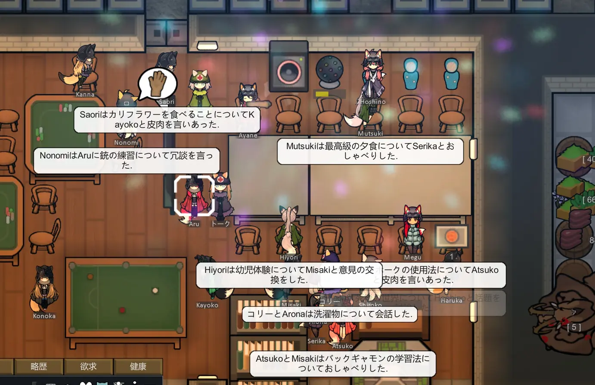
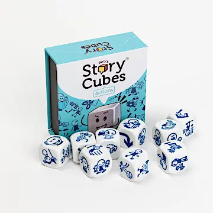
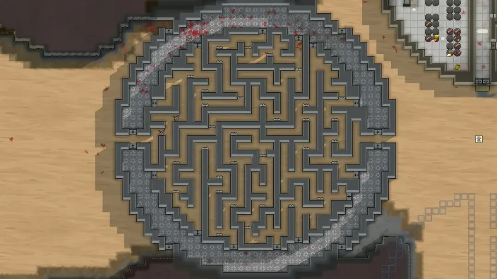
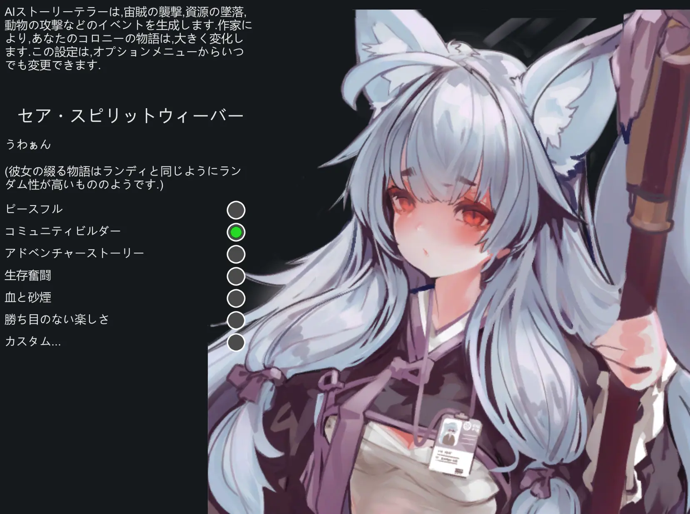
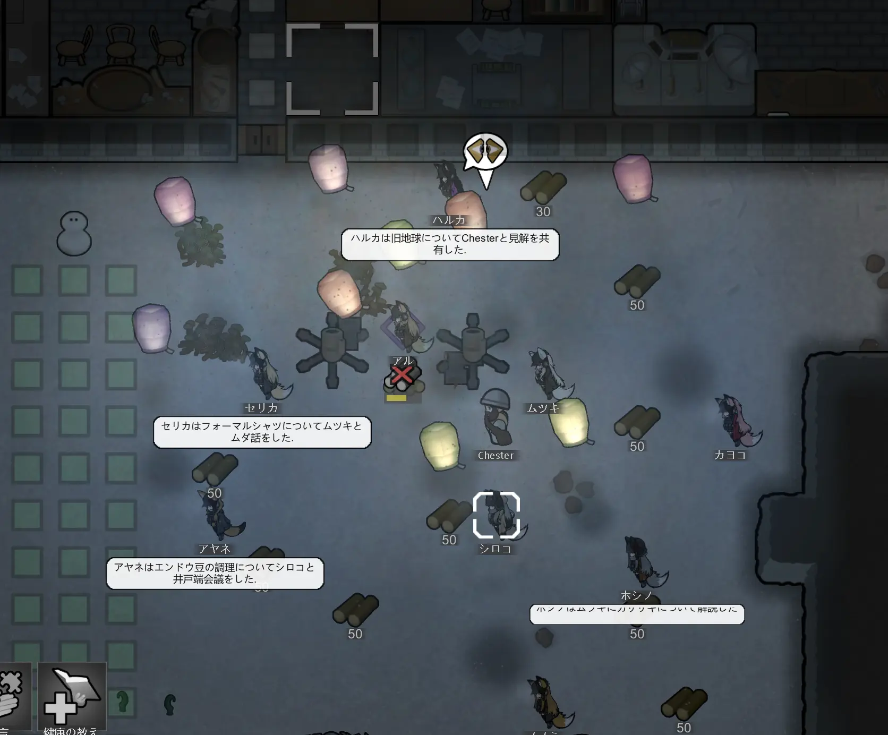

# はじめに

こんにちは[tsrm](https://sushi.ski/@tsrm)です。この記事はすしすきーアドベントカレンダー2024 Vol3 12/06として寄稿させてもらった記事です。自己紹介をさせてもらいつつ記事の内容を簡単に説明します。

## tsrm

絵を描いて面白おかしく暮らしている狼耳の美少女です。満月の夜だけ小汚いプログラマのおっさんゲーマーになります。得意なことはJavaScriptでフロントエンドのコード書いたりDockerで開発環境作ったりなんですが、今はGolangでバッチ書いてたりAWS CDKでインフラ構築してたりします。要するに何でも屋の雑用係です。趣味はお絵描きとゲームです。よろしくお願いします。これと全く同じ自己紹介の文章を12/02のアドカレ記事で読んだって？**勘の良いすしは嫌いだよ。**ご指摘の通りこの段落はコピペです。[嘘だと思うなら12/02の記事を読んでみてください](https://raw.githack.com/tsrkzy/ac2024_rimworld/refs/heads/main/1202/index.html)、何でもしますから。

この記事は僕が最も長時間プレイしたゲームの一つであるRimWorldについて書いたものです。内容はRimWorldの魅力や初心者向けのガイド、そしてやり込み要素の紹介を中心としてます。要するに布教記事です。

できる限り読みやすくわかりやすいように書いたつもりなんですが2万文字を超える長文になってしまい、こんな記事をゲームをやらないユーザもいるであろうすしすきーのアドベントカレンダーに投稿しても良いものか悩みつつ、フリーテーマという言葉を水戸黄門の印籠のごとく振りかざして投稿させてもらいました。

初心者がスムーズにゲームを始められるようにプレイのコツやおすすめ設定についても触れているので、**この記事を読んだ人が、RimWorld沼に頭から刺さるきっかけになれば良いなって思ってます**。

あと、この時点でRimWorldを買っちゃったぜ！っていう兵貴神速落書無用な人がいるかも知れないので先に説明しておくと、この記事のスクリーンショットのゲームデータには全て[美狐]()というMODを導入して可愛い狐耳ユニットが登場する状態で遊んでいます。「俺ちゃんはこの狐娘ちゃんでコロニーが作りたかったの！」と文句を言われそうでアレなので先に言い訳だけさせてもらいました。ちなみにSteamのワークショップで公開されているMODは全て無料で導入も簡単。是非ググってやり方調べて導入してみてください。

## RimWorldというゲーム

[RimWorld](https://store.steampowered.com/app/294100/RimWorld/)は、Ludeon Studiosが開発したPC用ゲームで、分類するならサバイバルとかワーカーシムとかそういうジャンルに分類することになると思います。

宇宙船の故障で惑星に墜落＝不時着した入植者たちが生き延びるためにコロニーを築いて生活するゲームで、ワーカーシムの名の通り、2Dデフォルメされたワーカーがちょこまかと自律的に動き回りつつコロニーを形成するので、**プレイヤーは神様というか守り神とかそういったポジションから様子を眺めたりあるときは指示を与えたりしながらそのコロニーの行方を見守るというそんなゲーム**です。

自律的に動き回るってのがミソで、僕はプログラマーなので決められたスケジュールと作業優先度に従って仕事をし、食欲を満たすために食事を取り、眠くなれば睡眠をとり、会話をして友好的な関係を築くこともあれば喧嘩をすることもあるワーカーが、好き勝手ワチャワチャ動き回りながらコロニーというシステムを構成する様子を眺めるのがぶっ刺さった感じです。他のゲームに例えるのがちょっと難しいんですよね。

  

  

  

気づいたかもしれないですが、この記事中でスクショを撮るために作成したセーブデータでは、ワーカーの名前をほぼ全てブルーアーカイブというゲームの登場人物から取っています。数が多くなってくるとどれがどういう事が得意かとか覚えづらくなってですね……。

# この記事を書いた理由

僕はこのゲームを友人の勧めで2019年8月に購入し、2024年11月時点で延べ1,973時間プレイしている**Rim星人**です。約5年間、1ヶ月あたりに換算すると30時間、つまりこの5年間で1日1時間欠かさず遊んでいる計算ですね、ホントかよ。

もちろん仕事や他の趣味で遊べない時期もあったはずで、それを考慮すると実際にプレイしていた期間中の1日あたりのプレイ時間はおそらく5時間を超えるはず。RimWorldをプレイしているときの僕は仕事・睡眠・食事・風呂以外の時間を全てRimWorldに注ぎ込んでいて、それこそ風呂にPCがあれば風呂に入りながらRimWorldをやっているであろうし、睡眠しながらRimWorldを遊べる未来の素敵なガジェットが存在するならば、寝ながら遊んでいることは疑いないです。

僕のゲーム仲間にもRim星人は多数存在し、プレイ時間が長いやつはゆうに**12,000時間**に迫っています。ちなみに12,000時間とは、食うや食わずどころか寝ずに**499日間24時間ぶっ通し**で遊んだ場合の時間。一日の半分をプレイに費やしたとしても、3年間近くかかる計算です。

記事を書くにあたって数字にしてみたけどえげつない数字ですね。大学受験をガチでやった高校生の勉強時間と同じぐらいですかね。そう考えると大したことがないような気もします。げに人間の時間間隔の相対的たるや。

ちなみに生きた時間に応じて時間感覚が変化する、歳を取ると1年が一瞬よねえ、みたいなアレですが、**それを考慮すると人生の折り返し地点は20歳ごろ**だそうです。あなたは人生の折り返し地点の手前ですか？後ですか？折り返し地点を過ぎてからどれぐらい過ぎましたか？やめましょうかこの話。

ただし、こうした**高位のRim星人**たちを悪く言うつもりは全く無くて、彼らの存在があるからこそ、僕は「自分はRim星人だがRim廃人ではない」と胸を張って~~言い訳~~主張できるわけです。彼らにはぜひ今以上に研鑽を積んでもらい、20,000時間の大台を目指して欲しいところ。いやーほら、12,000時間遊んでる人がいるんだから2,000時間しか遊んでない僕がもう1日ぐらいRimWorldのプレイで無駄にしてもいいじゃん？みたいな。そういうことです。

# 時間が溶ける

ここまで読んでもらえたならわかると思いますが、このゲームは危険なゲームです。僕の仲間うちでは、RimWorldについてこんなジョークが存在します。

> 「このゲームを買ったら、まず設定で現実の時刻をゲーム内に表示するオプションをONにしろ」

いや本当に、RimWorldを起動していると時間があっという間に溶けるんですよね。ゲームを終了するタイミングがないというべきか。金曜の夜にプレイを始めたが最後、土曜の昼に買い物に行こうと思っていた予定が吹き飛び、気づけば日曜の夜。挙句、トイレに行く回数を減らし、食事も睡眠も取らず、朦朧とした頭で月曜の始業を迎える──そんな経験が何度もあっちゃ困るんですが何度もあります。

一時期、**ResonanceAge**や**Phantasy Star Online 2**、**Final Fantasy 14**といったMMORPGにハマっていた時期もありますが、RimWorldはそれを凌駕してます。むしろFF14については、RimWorldを起動しながらシャキ待ちしていた記憶すらあります。結局シングルプレイヤーゲームなので、他の物事に干渉しないのが良いんですよね。プレイ中にちょっとYouTube見たくなったら起動しながら見ればいいし、友人からモンハンのマルチに誘われたら起動しながら参加すればいいし、プレイ中に始業時間になったら起動しながらリモートで朝礼に参加すればいいです。もちろん最後のは冗談です。ほんとほんと。これが嘘をついている人間の目に見えますか？

RimWorldがこれほどまでに時間を吸い尽くす理由は、最適化を追い求めても終わりが見えないことに尽きると思います。コロニーの強化を繰り返し、その結果生まれる新たな課題に対処しているうちに、いつの間にか時間が経っている。最適化を繰り返す最中に最適化の余地が生まれるという悪循環がゲームデザインから担保されているのでたちが悪いです。

最近まで、自分はプログラミングが好きだからこのゲームにハマったのだと考えていたんですが、プログラミングの知識が全くない知人がこのゲームにどっぷりハマっているケースもあるので、おそらく凝り性や潔癖症といった性格の人が特にハマりやすいゲームなのかなと思います。なのでこの記事を読んでるちゃらんぽらんでぐうたらなアナタ、RimWorldにハマる要素が全く無いので騙されたと思ってちょっと遊んでみてください。平気平気、ダイジョブダッテ！ユウジョウ！

# あなたもわたしもRim星人

なぜ僕はこの記事を書こうと思ったのかというところを振り返ってみます。**アークナイツ**のデイリーを放り出してアドベントカレンダーの枠を取り、VSCodeでMarkdownファイルを作成したのは金曜日の深夜2時でした。

テーマに困ってアドベントカレンダーの参加に躊躇していたのは事実ですが、どうしてこんな食いつきの悪そうなテーマで長文記事を書く気になったのか自分でも不思議です。よく考えればもっと他に適したテーマがあったはずなんですけどね。「2024年版僕の買ってよかった家具・ガジェットランキング」「コンビニ:まいばすけっとのおすすめ冷凍おつまみ」「アークナイツの推しオペレーター」「去年寿命で天に召された飼い犬の写真と思い出」とか、少なくとも、これらのテーマならもっと多くの人に読んでもらえるんじゃねって思います。特にひとつめとふたつめに関しては誰かが書いてくれたら絶対読む。

### 自問してみる

じゃあなんでRimWorldの記事を書いたのか。

> プレイ人口や同志を増やしたい？  

一応紹介記事の形を取ってますが、正直この記事読んでこんな古臭いPC用ゲームやってみよう！って人いないと思うんですよね。それにこんなおひとり様用ゲームで他人はノイズだと思います。コロニーを見せ合ったりMODについて語ったりするのは楽しいけど、それならDiscordやSteamのコミュニティ、Redditで事足りるし。  

> 知識をひけらかすことで自己承認欲求を満たしたい？  

前述しましたが、RimWorldの2,000時間プレイは特別なものではなくてむしろ平均的なプレイ時間で。それにこのゲームは攻略サイトや動画が充実しているので、いまさら薄っぺらな攻略記事を書いても底の浅さがすぐ露呈してしまうので、それも違うかなって。

> 他人に影響を与え、自己効力感を得たい？  

これが一番可能性が高そうですが、それにしてもこのテーマで？って感じがします。前のセクションで挙げた他のテーマのほうが広範囲にアピールできそう。

例えば、[まいばすけっと](https://www.mybasket.co.jp/)のおすすめ冷凍おつまみ。2024年版なら[肉付きヤゲン軟骨焼きと砂肝塩焼き](https://item.rakuten.co.jp/beisia/4573502870144/)が最強だと思いますんで、近所にまいばすけっとがあるならぜひ試してみてほしいです。缶コーヒーとかお茶のペットボトル買うついでについ買っちゃう。冷凍食品のくせに常温で解凍して食べられるのも高得点です。これこそUXを重視したデザインというやつだと思います。

### 答えはわからない

結局のところ理由はわからずなので、書いちゃったという表現が適切だと思います。あえて理由をつけるなら、**宇宙的な意思**というやつかもしれない。  

だから、この記事を最後まで読もうと決意した不運な主人公であるあなたにも、ある種の運命が待っているのかもしれない。この文章を読んでRimWorldにのめりこんでしまう人に、H.P.ラヴクラフトの「インスマスを覆う影」の主人公が辿る運命が重なる。あの話で主人公は、自分の中に流れる異形の血に気づき、抗うことなく受け入れてしまうけれど。

初めてプレイする時点では、まさかこれほどまでに時間を吸い取られるゲームだとは思わない。しかし、気づけばコロニーの最適化にのめり込み、膨大な時間が溶けていく。プレイヤーが抗おうとするほどに、ゲームはその本質的な楽しさで引きずり込む。RimWorldにハマるというのは、ディープワン――ではなく、**Rim星人**としての自分を受け入れるようなものかもしれない。

僕はゲーム仲間ほぼ全員にこのゲームを布教したけど、Rim星人に転化したのはごく一部だった。その一部の彼らは、今日も幸せそうに口からよだれを垂らしながらDiscordに知見を投げつけている。  

> 大丈夫、このゲームは巷で言われているほど危険ではない。  
> 一部の人間はRim星人になるかもしれないが……君は**もちろん**健全な体質だろう。  

# 世界観 = 荒廃した惑星と発達した科学技術

RimWorldの舞台は、惑星間航行が可能になった未来。高度な科学技術が存在する一方で、舞台となるのはその恩恵が届かない、銀河の片隅に打ち棄てられた辺境の惑星(RimWorld)です。そこに宇宙船の故障によって入植者達が不時着してくるところからこのゲームは始まります。入植者たちの過去には全く触れられません。一応ランダム履歴ジェネレータが各入植者のバックストーリーを自動生成してくれるんですがその程度です。星間旅行者だったのか、どこからかの脱走者なのか、あるいは犯罪者だったのか。入植者たちの過去は、プレイヤーの想像に委ねられます。

そんなこんなでRimWorldに墜落した彼らですが、**この惑星は決して穏やかな場所などではなく、明日の命も保証されない世界**でした。惑星システムを管理するAIは狂い、制御を失ったドローンが精神波を垂れ流して入植者たちを精神的に追い詰める。さらに、生産や治安維持のために設計されたはずの機械生命体は、人間を見かけ次第敵とみなして襲いかかってきます。

じゃあ住んでる人間たちは一致団結して機械生命体の脅威に立ち向かっているのかというとそんなこともなく、コロニーを襲撃する宙族(raider)、他部族を食料とする食人族(cannibalist)、帝国の特権階級、正体不明の存在を崇拝する狂信者たちと勢力ごとに別れて好き放題争い合っています。人間は愚かだワン。

自然もまた苛烈で、寒波や熱波は突然襲いかかり、どこかで火山が噴火すれば火山灰が空を覆い農作物は壊滅。放射線降下物(fallout)が降り注げば、生き物は次々と命を落とす不毛の土地となり、数ヶ月から数年にわたって食料の自給が期待できない死の大地になったりします。

要するに、この世界は**ニンジャスレイヤーのネオサイタマとパラノイアTRPGのアルファ・コンプレックスを足して荒廃度を倍増させたような惑星**です。有名なオープンワールドゲームであるKenshiの世界観とも共通するところがあるかも。プレイヤーは、この過酷な環境で入植者たちを生き延びさせるという無理ゲーに挑むことになります。

# ゲームスタイル

RimWorldは、コロニーシミュレーションゲームの中でも特に影響力の大きいタイトルです。そのゲームデザインは、後に続く数多くの同ジャンル作品に影響を与え、その多くがRimWorldの設計思想を継承しています。いやね、このゲームを遊ぶと、別のシミュレーションゲームを遊んだときに気づくんですよ。「これRimWorldでやったところだ！」って。まさにコロニーシミュレーションゲームの進研ゼミ。Magic: the Gatheringを遊んだことのあるトレーディングカードゲーム・プレイヤーが他のTCGを遊ぶときに感じるようなアレです。ああアンタップね。ああクリーチャーね。ああカウンターね。ああトランプル持ってんのね。ああソーサリータイミングだけなのね。的な。

RimWorldには「ピクミン」や「Ratopia」のように**プレイヤーが直接操作する主人公的なユニットは存在しません**。プレイヤーはコロニーそのものの集合的な意思として行動の優先順位を設定し、大まかな指示を与え、コロニーを導きます。入植者たちはそのルールに従って自律的に動きながら、日々の作業をこなします。ときには、様々な内的・外的要因でプレイヤーの予想を超えた行動を取ることも。

資材を集め、農作物を育て、住居を建てるといった基本的な生活から始まり、脱出用ロケットを建造するための技術研究や、襲撃者に備えた防衛設備の構築に至るまで、プレイヤーが整えた仕組みの中でワーカーは自律的に行動します。ここがこのゲームのキモで(といってもキモが6個ぐらいあるけど)、ユニットの得意不得意や特色に合わせて作業を割り振ることになります。

この「行動優先順の管理」が若干プログラミングライクな操作で、どの行動を誰に割り当てるか、どの設備をどこに設置するかといった細かい最適化を繰り返すことで、コロニー全体が自律的に動き始めます。それが気持ち良い。何もしなくて良くなるというか、自分がやることが減るというか。でも決してゼロにはならないというか。その塩梅が絶妙なゲームです。

# 心情とメンタルブレイク

RimWorldに登場する入植者たちは、それぞれが心情(mood)という精神状態を示すパラメータを持ってます。この心情が極端に低下すると、彼らはメンタルブレイク(mental break)という形で発狂します。要するに**クトゥルフTRPGの正気度と一時的発狂ですね**。   

メンタルブレイクは、プレイヤーにとってコロニー運営の大きな障害になる存在で、例えば長期間空腹が続いたり、睡眠不足や友人の死が原因で精神状態が悪化すると発生します。また、生活空間の汚れや敵の死体の放置も、心情を大きく損なう要因になります。このゲームは変なところがリアルなので、戦闘で敵を殺害するとその死体が残ります。焼却するなり埋めるなりして処理する必要があり、ほっとくと腐ります。腐った死体を目にした入植者の心情低下は酷いです。

メンタルブレイクにはさまざまな種類があって、比較的穏やかなものとしては、物にあたる、引きこもる、泣きながら徘徊するとかですね。一方で深刻なものでは薬物乱用、放火、さらには他の入植者への暴行や殺害なんかも発生します。

まあ字面でわかると思いますが、殺害なんかは致命的です。このゲームは入植者同士が恋人になったりするので、恋人を殺した犯人に対しては友好度が下限の-100に固定されます。よくもあたしの彼ピを！ってことですね。そうなると殺害犯はコロニーで孤立し、さらに心情が悪化してまたメンタルブレイクを起こしたりします。楽しいゲームですね。

だもんで、これらの問題を未然に防ぐために様々な対策を講じる必要があります。死体の速やかな火葬処理。汚染物の適切な処理。コロニーの内装デザインの改善。なんで僕がお前らのご機嫌取りをせにゃならんのだという感じはしますが、そうしないとひどい目に遭うので仕方がないですね。入植者の性格によっては他の入植者より部屋が広くて豪華じゃないと心情が悪化するとか、いやいや部屋は土床じゃないと心が痛むんですとか、定期的に処刑しないとテンション下がるとか、人肉食べないと気が済まないとかやべーやつばっかです。そういう**やべーやつをコロニーに勧誘しないようにするという選別が重要**だったりします。やべーやつが最初からコロニーいたらどうするんだって？諦めろん。

# RimWorldの遊び方

実のところ、この記事を読んで「**RimWorldやってみたい！**」と思ってくれた方がいたとしても素直に喜べないというか、むしろ心配になるというか、いやRimWorld自体は非常に楽しいゲームなんですけど、何を隠そうこのRimWorldというゲーム、UIや操作性は素朴で洗練されておらず、ゲームデザインはハードコアで、難易度は初心者殺しなんですよね。

しかもデモ版(無料版)がないもんだからゲームの核心部分にふれる前に心を折られて「せっかく買ったけど合わなかった」とSteamの返金機能を使って返金してしまうプレイヤーがめっちゃ多いんです(僕調べ)。

こちらとしても、せっかくこの記事という毒酒を呷ってくれたのだから、飲んだ後に「ああ、美味しい酒だったな、**こんなにきれいな幻覚が見えるようになった**」と言ってもらえるような、そんな記事を書きたいと思ってますが、果たしてそれが可能なのか。

というわけで、スムーズにRimWorldに墜落できるようにガイド記事を書いていきます。攻略記事のような突っ込んだものではなく、他のゲームと比べてどういった違いがあるので最初はこうしたほうがいいよ、程度の内容に収めます。というかこの記事を読んでいる途中でRimWorldを早速起動したくなる人もいるかもしれないので最初に結論を言ってしまうと、**プレイ難易度は下げ、攻略情報が見たければどんどん見て気負わずに遊んで欲しい**というところです。マジで。

## 洋ゲー特有の難易度とUI

RimWorldの特徴として、自由度が高くゲームバランスがシビアという点があるんですが、その高い自由度故に**初心者は何をすべきかわからないうちにコロニーが壊滅**してしまい、多くの初心者が「なぜこのゲームが世界的に評価されているのかわからない」と感じてしまうという欠点があります。特にUIが分かりづらいって部分と、ゲーム序盤に何して良いんだかわからんっていうのはRimWorldあるあるだとおもう。

最近出たアーマード・コア6ってゲームのチュートリアルステージのボスがクッソ強くて、Xが阿鼻叫喚になり「これチュートリアルじゃねーだろ！」っていう怨嗟の声で満ち満ちたのは記憶に新しいですが、まさにそんな感じで、RimWorldはチュートリアルがないわけではないんですが、それでも難しいんですよね。

### 難易度は柔軟に調整しよう

RimWorldのゲームデザインは、ゲームデザイナーのTynan Sylvester氏が「RimWorldはストーリージェネレーターであり、コロニーの全滅や入植者の理不尽な死もゲームの一部」と述べてます。わかりやすいように言い直すと「このゲームは運ゲーだし、死にゲーだし、理不尽なゲームだし、それが楽しいんだよ！」ってことですね。まあわからんでもないんですが、ゲーム始めたてのやつが理不尽にワーカーをぶっ殺されて凹んでるところにそんな言葉投げかけたら下手したら乱闘になると思うんですよね。いや、このゲームだと人が簡単に死ぬというか命が軽いというか、過酷な世界を舞台にしているので仕方がない部分ではあるんですが。

そういった背景があるので、自分のプレイスタイルに合わせてゲーム難易度を下げることに躊躇しないで欲しい、ってことです。ゲーム難易度が下がれば乱数の影響は減って敵の襲撃規模は小さくなり、コロニーが受けた被害の建て直しは容易になります。

### 難易度設定とオートセーブの重要性

RimWorldでは、難易度をゲーム中いつでも変更でき、**オートセーブ機能**を有効にすることで、ミスをしても直前の状況に戻れるようになります。ああ、素晴らしきかなオートセーブ。最近のお絵かきソフトもオートセーブ機能がついているので助かります。人生にもオートセーブ機能が欲しいですね。どのセーブポイントに戻りたいですか？過去のどのセーブポイントに戻ってやり直しても現在の地点に収束してしまう、しかも主人公の精神だけは歳を取っていくので最終的に若くして狂気に陥ったり精神的老衰で死んでしまう、みたいなホラーは読んでみたい気がします。そういう作品を知ってる方いたら教えて下さい。

ということで初心者には難易度「コミュニティビルダー」をオススメします。コミュニティビルダーは二番目に易しい難易度であり、僕は普段はコミュニティビルダーで遊んでます。それより難しい難易度で遊んでも良いんですが、正直それらはチャレンジコンテンツのような難易度と捉えたほうが良いです。RimWorldって地の難易度が高いので、開発がノーマルだと言い張ってる難易度で遊ぶと苦しくて楽しいけど死ぬほど疲れるんですよね。コミュニティビルダーなら敵の襲撃はほどほどに来るしほどよいですね。銭湯で例えるとアツ湯もいいけど温めの湯がいくらでも浸かってられるよねって感じです。

このゲーム、戦闘が起きると敵味方ともに無傷では済まないという調整がされているので、大なり小なりの戦闘を数多くこなすと、コロニーの入植者たちは完治しない負傷や、悪くすると脳への打撃や四肢の欠損を負います。これらは作中に登場するオーバーサイエンスな技術、例えばヒーリングシーラムという治療用ナノマシン注入薬を使えば治療できないこともないんですが、それらが入手できるのはゲーム終盤になってからだし、それまでは義足などで間に合わせることになります。義足フェチの方がひょっとしたらいるかも知れないんですが、この世界はバリアフリーなどという概念を辞書に載せるほどの余裕がないので、言葉を選ばず言ってしまうと、部位欠損した入植者はコロニーのお荷物になります。つらい。遊んでいると感情移入してしまうのでなおさらつらい。

繰り返しになるけど、難易度は下げ、オートセーブは有効にして遊びましょう。プレイミスしたな……と思ったら気にせずセーブポイントに戻ってやり直しましょう。前述の通り、この**ゲームは意図的に事故が起こるようにデザイン**されてます。誰に見られてるわけでもなし、**危機に対応できるかどうかと、対応したいかどうかはまた別の話**。自分の楽しみ方を優先しましょう。

### 戦闘が起きない難易度の是非

> 難易度は下げるべきだというならば、**ピースフル**という一番易しい難易度にすべきではないか？

という意見、絶対出ると思ってます。ですが、これに関してはNOと言いたいです。ピースフルでは襲撃というイベントが発生しないんですね。RimWorldの戦闘ってタワーディフェンスのようになかなか良く出来ていて、このゲームの楽しさを構築する重要な要素になってます。それを捨てるなんてとんでもない。ということで、**極めて小規模だが敵が襲って来るゲームと敵が襲ってこないゲームではプレイ体験が大きく異なる**からだ、っていうのが大きな理由。

コミュニティビルダーならば襲撃は発生し、襲来する敵の規模がやや小さめになるという調整になるため、どのようなコロニーを作れば守りやすいか、どういった箇所がコロニーの弱点になるかを肌で覚えられます。このゲームの開発陣は頭が良い上に変態的に性格が悪いので、こちらが取るであろう防衛方法を想定して的確にメタ(対策)ってきます。詳しくは割愛しますが、ただ強固な防衛陣地を作るだけだと、いやこれ防衛陣地を壊すためだけに作られた戦闘ロジックだろ、っていう動きをする敵が襲ってきたりします。マジでクソです。最高。

## 攻略動画と攻略サイトとネタバレ

恐ろしいことに、このゲームは2024年になっても未だに新しいDLCが開発され公開され続けてます。そのためYouTubeやニコニコ動画にはRimWorldに関する攻略動画が現在も投稿され続けており、日々知られていなかったシステムや攻略方法が発掘され続けています。

ところでその一方、「攻略情報やストーリーを事前に知ることでゲームの楽しみが半減する」という意見があると思います。例えば、以下のような。

> ゲームシステムやストーリーは、自分の目で見て理解して初めて価値がある。

まあ言いたいことはわからんでもないですが、RimWorldに関してはその心配は不要かなと思います。

### ストーリーのネタバレを恐れる必要はない

RimWorldはストーリーテラーAIというシステムが存在し、プレイヤーの状況を加味したうえで「こういうイベントがあればドキドキハラハラを楽しんでもらえるやろなあ」というイベントを発生させてきます。なので同じエンディングに到達するとしても100回プレイすれば100回の異なるストーリーが生まれるし、そもそもエンディングに到達しないという遊び方も可能です。ということで、**RimWorldにおいて、ストーリーのネタバレを恐れる必要は一切ないです**。

#### 攻略方法もどんどん調べてしまおう

では攻略方法はどうだろう？

> 効率的なコロニー設計を事前に知ることは、ゲーム体験を損なうのではないか？それはある意味で卑怯なプレイと言えないか？

例えば、バイオハザード2のダイヤル鍵の番号を予めインターネットで調べておき、初回プレイからその番号を調べるプロセスを丸々スキップするのはズルじゃね？って話ですね。僕は初回プレイでそこで苦しんだんだから、後続プレイヤーのお前らも苦しめ！っていう老害気味な思考が含まれてる感じもありますが、でも例えばその鍵の番号を知るためにちょっと強いボスがいたりしたら、それを倒さずにゲームをクリアするのはもったいないような気もします。逆に、鍵の番号を知るためにただただ長い道を歩かされるだけならそれはゲームデザインとして失敗だと言えるかもしれないし、このご時世ですからスキップ方法がインターネットで共有されるのもむべなるかな、とも思います。

じゃあRimWorldの攻略法を事前に調べたり、もしくは調べながら遊ぶのはどうなの？って話になるんですが、これは全然やっていいかなって思います。今まで述べた通りRimWorldは難易度が高いゲームなので、初回プレイする人の殆どは大事故を起こしてコロニーを滅ぼしていることと思います。既プレイヤー視点だと是非1回はコロニーを滅ぼす経験をしてほしいなあとも思うんですが、発売から数年たってるゲームなので今さらかなあとも思います、ただ、ちょっとネットで攻略法調べた程度でこのゲームがきれいにクリアできない事も知ってるんですよね。

このゲームって頭の良い開発陣と頭の良いプレイヤーが「いかに効率よく敵を撃退するか・させないか」のいたちごっこを繰り返しながら発展してきたゲームで、ネットで公開されている攻略法は確かにその中でも最も効率的な方法なのかもしれないんですけど、それは自ずと別の問題、その効率的な方法をプレイヤーが十全に理解して使いこなせるのか？という問題を発生させるんですよね。RimWorldはゲームデザインがハードコアなので、攻略法を知っているだけでゲームをクリアできるほどヤワなゲームデザインではないんですよ。なので、それを使いこなせるようになるまでの過程もまた楽しいんですよね。

なので、好きなだけネットで調査し、それを自分のコロニーに応用し、その上でRimWorldのストーリーテラーAIが起こす襲撃イベントや気象イベントに叩きのめされて欲しいです。それが発売から数年たった現在の時点での一番賢いRimWorldの楽しみ方だと思います。

ということで幾つか攻略リンクを貼っておきます。ぶっちゃけこんな記事なんか読んでいないでこれらの動画を見てもらったほうが話が早いんですが、せっかく書いた文章を自分で否定するのも悲しいので、**できればこの記事を読み終わってから読んでね！**ってぐらいにとどめておきます。ちなみにどの動画も結構なボリュームなので、とりあえずSteamのカートに突っ込んであるRimWorldを購入してから見たほうが良いと思います。

<iframe width="560" height="315" src="https://www.youtube.com/embed/-qJuFPfuKZo?si=p-5H3Yg5VpKht-2G" title="YouTube video player" frameborder="0" allow="accelerometer; autoplay; clipboard-write; encrypted-media; gyroscope; picture-in-picture; web-share" referrerpolicy="strict-origin-when-cross-origin" allowfullscreen></iframe>

<iframe width="560" height="315" src="https://www.youtube.com/embed/C5jh-eFyEFo?si=Tfg7Tsf1fLfQn5sE" title="YouTube video player" frameborder="0" allow="accelerometer; autoplay; clipboard-write; encrypted-media; gyroscope; picture-in-picture; web-share" referrerpolicy="strict-origin-when-cross-origin" allowfullscreen></iframe>

これは敵の行動アルゴリズムなどに触れているので上級者向け
<iframe width="560" height="315" src="https://www.youtube.com/embed/rcilAWODASU?si=1-UErQ_JZDKWIFI2" title="YouTube video player" frameborder="0" allow="accelerometer; autoplay; clipboard-write; encrypted-media; gyroscope; picture-in-picture; web-share" referrerpolicy="strict-origin-when-cross-origin" allowfullscreen></iframe>

有志によりWikiも運営されている。

* [RimWorld Wiki(JP)](https://wikiwiki.jp/rimwikijp/guide#f3049dd8)   
* [RimWorld Wiki(EN)](https://rimworldwiki.com/wiki/Main_Page)   

## 入植者の見た目を変更する

ゲームの内容からはやや離れた話になるけども、入植者の見た目を変更するMODを導入することをオススメします。例えばこの記事の冒頭で言及していた狐耳種族のMODなんかがその例ですね。このゲームのユニットの見た目はデフォルトでは非常に芋臭いので、モチベーションを上げるためにもとりあえず変更しておくと良いです。コロニーを構築する入植者とは長い付き合いになるしね。

](./img/0110_default.webp)

## 開発者モード

オプションに「開発者モードを有効化」というオプションがあって、それを有効化することで様々な**開発用コマンド**が使えるようになる。

1. 死亡したユニットの蘇生
2. ユニットが負った不可逆な負傷(四肢の喪失、脳の損傷など)の治療
3. 好きなアイテムの出現
4. 研究の即時完了
5. ユニットがダウンするHPダメージを即座に与える

> ん？ちょっとまって！これって**チート**じゃないの？

微妙なニュアンスの違いだけど、チートはゲームデータを改ざんあるいはネットワークに介入するなどしてゲーム内で不正な行為を行うことを指す。対してこちらは開発者コマンドで、オプションから自由に有効化することができて、隠しコマンドってわけでもない公式機能。広義ではチートと表現しても間違いないけどね。

何回も書いてきたけど、このゲームは少しのミスで、あるいはミスをしなくても運が悪いと入植者が理不尽に死亡したり、腕や脚を吹き飛ばされて戦闘能力を失ってしまうゲームバランスになっている。敵として登場したユニットを味方に引き入れることもできるから、味方として勧誘しようとしたら先程の戦闘で片腕がもげていた……ということもままある。

コロニー運営にとって、多少のアクシデントはゲームプレイに対してのスパイスになりうるけども、不可逆なアクシデントはストレスたり得る。開発用コマンドで、そういったストレスを和らげることができるなら、特にゲームに慣れていない序盤のうちは積極的に利用したほうがいいです。もちろん、開発者モードを使用せずにゲームに真正面から向かい合うハードコアなプレイスタイルを僕は否定しません。僕も1回クリアするまではその方針で遊んでたしね。

繰り返しになるけど、開発者ツールはオプションから自由に使用することが可能な公式機能。隠し機能でもなんでもないので、負い目を感じずどんどん使おう。どうせこのゲームをやり込めば、「こういう状況だとどうなるんだ……？」って検証するのに非常に便利なので使い倒すことになります。

# やり込み要素

このゲームのクリア条件は複数存在していて、いずれもRimWorldという惑星へ墜落し遭難していた入植者達が、最終的に星外へ脱出するというもの。DLCによって追加されるものも含めて、基本的なものをいくつか紹介しよう。

1. 研究を進め、ロケットを作成して脱出する
2. マップ上をコロニーを作りながら移動し、放棄されたロケットの元へたどり着いて脱出する
3. コロニーを発展させ、総資産を一定の金額以上まで稼いでコロニーごと売却することを3回繰り返す

もちろん、これらのクリア条件の達成は「MineCraftでエンダードラゴンを倒す」のとほぼ同義。**ロケットを建築せず、コロニーを発展させて整備し、定住することも可能**。これは勝手な想像だけど、過半数以上のプレイヤーはこのプレイスタイルに落ち着くんじゃないかなと思ってます。

### 定住

前項で書いた通りで、このゲームには「星外へ脱出する」という目標が設定されています。そこにたどり着くまでの過程をまとめるとこんな感じ。

ゲーマーはこの図を見た時点で変な笑いが出るんじゃないかなって思います。勘の良いゲーマーは嫌いじゃないよ。そう、モンスターハンターで強い敵を倒すための強い武器を作るために強い敵を倒す必要があるという例のアレです。そのせいで、ロケットの建築というクリア目標があるにはあるんですが、大半のプレイヤーはロケットの脱出を目指す最中に手段が目的と化し、脱出することを忘れてRimWorldに根を下ろしちゃうんですよね。

このコロニー強化ループのイテレーション(iteration:繰り返し)こそが、RimWorldを中毒性の高いコロニーシミュレーションゲームたらしめている元凶というか悪の根源というか。このイテレーションに含まれる要素をブレイクダウンしたんですが、雑にまとめてもこれだけの要素を含んでます。

1. 拡大再生産(extended reproduction)
   1. 資材を集める施設で集めた資材で施設を強化してさらに資材を集められるように
2. 生産管理
   1. 必要な資材を必要な数だけ高品質に作成し必要な場所へ届ける
   2. 素材格納庫と生産場所、生産品格納庫の導線を短くする
3. 戦略(strategy)
   1. 接敵するまでに行う戦闘技術
   2. 食料と薬品、修理用資材を整え、迎撃地点を構え、武器を揃えて、戦闘スキルを成長させておく
4. 戦術(tactics)
   1. 接敵してからの戦闘技術
   2. 構築した迎撃地点を活かして戦闘する
   3. 敵は毎回マップの端からやってくるとは限らず、降下襲撃や砲撃にも臨機応変に対応しなければならない

これらってひとつで大体ひとつのゲームができちゃうぐらいの濃い要素なんですが、それらが詰め込まれてるってわけです。そりゃあ中毒性が高いわけですよ。おまけにコロニーの拡充vs運搬動線の短縮みたいな相反する要素もあるので、プレイヤーはそのジレンマに苦しみながらコロニーの最適化を行う羽目になります。

## 考えることが尽きない

ここからはコロニーの建築・増築・改築時に考えていることをつらつら書き出していきます。RimWorld学会では日々新しい学説が提示されており、ここに挙げたものはその一部で、ぶっちゃけ興味がない方には非常に退屈な内容だと思うんでスキップしていいです。見出しに **読み飛ばしてOK** と書いといたんで、その箇所は読み飛ばしてください。

### 距離と動線(読み飛ばしてOK)

物資は生産した後運搬する必要があり、保管しておく場所の確保も考える必要があります。それを怠ると入植者達が食事を摂るためだけにコロニーの端から端まで移動する羽目になったり、襲撃が発生したときに迎撃用の装備品を揃えるのに時間がかかったりで百害あって一利なしです。戦闘の準備に時間がかかったので野盗に防衛ラインを無血突破されちゃいました、という事になったら目も当てられません。

なのでアクセス頻度が高い倉庫は基地の中心に置き、生産設備や調理場、宿舎などはその周辺に配置していくのがベストでしょ、というのがRimWorld学会の通説なので、よくよくしばしば円形のコロニーデザインが使用されます。以下の画像はRedditで行われている議論スレッドから拝借してきました。僕もこの形をよく利用させてもらってます。

["円を基本とした反復拡張が可能なコロニーデザイン" Infinitely Repeating Modular Circle Base Design](https://www.reddit.com/r/RimWorld/comments/8luo1c/infinitely_repeating_modular_circle_base_design/?rdt=56684)   

### キルゾーン(読み飛ばしてOK)

敵を効果的に迎撃するキルゾーンの形状についても日々研究が行われています。入植者たちの数、遠隔・近接適正、武器種を考慮したキルゾーンを設計して敵を効果的に撃退する必要があります。これは近接武器縛りでプレイするときに最適な迷宮型で、最短経路を通って移動するという敵のアルゴリズムを逆手に取り、ドアから横撃を加えることで敵を分散させるというキルゾーンです。

["近接格闘武器のみを装備したコロニーにおいて最適な、迷宮型を採用し、襲撃者を分散させて近距離のタイマンに持ち込むためのキルゾーン設計" The Melee Killmaze (A killbox for melee colonies)](https://www.reddit.com/r/RimWorld/comments/yklg9u/the_melee_killmaze_a_killbox_for_melee_colonies/)   

形や内容も重要ですが、キルゾーンを建設する場所も問題で、例えば農業区域の牧草の上で敵の火炎弾を受ければ入植者たちはあっという間に火だるまになるし、燃料庫を背にして戦うのは愚の骨頂。戦闘では負傷者が出ることを考慮しないと行けないため、速やかに治療を行えるように、医療設備にある程度アクセスが良いところに構築したほうが良い……という観点も必要です。   

> ここまで読んで、面倒くせえ……！と感じてると思います。僕も書いていてつらくなってきたんですがまだまだあるから困る。

### 戦闘の後始末(読み飛ばしてOK)

敵を撃退したらしたでその後始末も大変で、戦死者の死体をそのまま放置しておけば人間の死体を見てしまったという形で入植者たちの心情に悪影響が発生。なので可及的速やかに火葬するなり埋葬するなり解体するなりする必要があります。これを怠ると戦闘後のリカバリを行うべき重要な時期に、入植者たちがメンタルブレイクを引き起こすという至極面倒極まりない事態に陥る可能性があります。

マップ上の生産設備や建築物などは耐久値を持ち、流れ弾などを受けると耐久値が減り、耐久値がゼロになった建築物は当然ながら破壊されてその機能を失ってしまうため適宜修理する必要がありますし、破壊されていたら建築し直す必要があります。

また、ユニットが死亡すると、それが所持していたアイテムが付近に散らばってしまいキルゾーンの機能に影響が出ることがあります。また、それらに戦闘中に引火すれば、その火は戦闘中の入植者たちに燃え移る可能性もあります。何よりそれらは重要な資源なので、食品や薬品は回収し、武器類は鋳潰して金属資源へ変換しておくべきです。

## 自動化

そろそろうんざりしただろうしもう読まないでタブ閉じるか、みたいになってると思いますが、健全で効率的なコロニーの運営を行う上で考慮すべきことはここに記載したもの以外にも大量にあります。ただし、**実はプレイヤーはこれらをすべて手動で行う必要がありません**。前述の通り、RimWorldは入植者の行動をある程度プログラミングできるので、これらの設定を組み合わせることで、ここまで書いた処理をほとんど自動化することができます。楽しいんだこれが。

# 出来上がったコロニーを眺めながら

これらの設定と優先順位付けが適切に行われたコロニーは、一つのシステムであると言っても過言ではないでしょう。これは言葉の通りで、これらの条件設定が適切に行われたコロニーを一度構築してしまえば、プレイヤーが行うのは戦闘モード・通常モードの切り替えぐらいで済みます。自分が作ったシステムがうまく機能しているのを眺めるのはなんとも言えない快感があるんですが、これを言語化するのが非常に難しくてヤキモキしてます。精巧に作られたアナログな大時計の歯車がうまく噛み合っている様子といおうか、終わらないピタゴラスイッチを眺めている気分といおうか。半分冗談ですが、このゲームを小学生にアルゴリズムの勉強代わりにやらせても良いんじゃねって思ってます。いやほんとに。

さて、自動化が済んで時間に余裕が生まれたら、ランダムに発生するイベントに対して手動で対処しつつ、入植者たちの行動の最適化が甘い部分を見直しつつ、コロニーの動線がイマイチな部分を模様替えしつつ、ちょっとすしすきーのLTLを眺めつつ、裏で絵を描きつつ、アドベントカレンダーの記事を書いたりすればいいってわけです。または、ゲームのクリア条件であるロケットを作って脱出するぜ！っていう奇特な人は、近くに友好的な派閥の本拠地があればそこに交易キャラバンを送って資材集めを行いましょう。

## ランダムイベント

コロニーの中で暮らす入植者たちは入植者同士(時には捕虜にした襲撃者)と恋に落ちたり、結婚したり、その後あるいはその前に破局を迎えて発狂したり、落雷に見舞われて火事に遭ったり、疫病に感染したり……仮に理想的なコロニーを構築したとしても、その上でプレイヤーを飽きさせないイベントが大量に実装されています。

例に上げたようにその内容はさまざまで、小は入植者同士が殴り合いのケンカをして負傷するところから始まり、大は火山が大噴火して空が長期にわたって灰に覆われ氷河期が到来、農耕が不可となり気温が急低下したりなど、ここですべて紹介するのは不可能なほどの種類が存在します。

それらを絶妙な塩梅で発生させるためにAIストーリーテラーというゲームシステムが実装されていて、それらのお陰で、例えばゲーム開始直後の4人のコロニーにいきなり50人の野盗の襲撃が来たりということは起こらないし、ゲームスタート早々に氷河期イベントが発生し作物も野生の動物も全滅して食料がなくなり詰む、ということも起こらないようになっています。AIストーリーテラーが「ゲーム内のコロニーのデータから判断して、これぐらいの脅威が発生しても、プレイヤーが頑張ればまあ骨折ぐらいのケガで済むだろう」という計算を行ったうえで、**いい感じにプレイヤーが苦しむことができるようにイベントを用意してくれるってわけです**。もちろん、難易度によっては骨折がかすり傷で済むようになっているかもしれないし、逆に高難易度では対処を少しでも誤れば致命傷になることも。

また、AIストーリーテラーには人格がいくつか用意されており、プレイヤーが選択できるようになっています。主に入植者の心情に打撃を与えるイベントを用意して発狂させることでコロニーにダメージを与えるカサンドラ。イベントの発生周期が長いが一つ一つのイベントの破壊力が非常に高いフェーベ。ランダム性が非常に高く何が起こるかわからないランディなど。これら以外にもMODでAIストーリーテラーを追加することができるし、難易度と同じく、ゲームプレイ中にAIストーリーテラーを切り替えることも可能。長期間のTRPGセッションのように、GM(RNGと呼ぶほうが適切かもね)を定期的に交代させることで、起伏に富んだゲームプレイ体験を楽しむことができるってわけです。

# DLC

RimWorldは現在も開発が続けられており、不定期ではあるがバージョンアップとともに有料DLCがリリースされています。いずれもゲーム内に要素が追加されるもので、導入はプレイヤーの意思に委ねられています。例えば、Biotechは導入したいが、Royaltyは肌に合わなかったので導入せずにプレイしたいといった形も可能で、**導入したいDLCだけを柔軟に選択することが可能**です。

ということでDLCを片っ端から紹介していきたいんですが、すべてを紹介するとボリュームがとんでもないことになってしまうので、簡単に説明だけさせてもらう形にしようかなと。詳しく知りたい人はまあ、Steamで買って遊んでみてください。

## Royalty

日本語に直訳すると**王家**あたりが適切かな？RimWorldは開発に失敗した惑星のような荒廃した世界観のため、惑星上の文明レベルはひどいところでは原始時代まで巻き戻っていたり、野生の人間が登場したりします。文明についても然りで、このDLCでは貴族のような特権階級と、それに支配される支配階級、さらに中世ファンタジーに出てくる魔法のような超能力(Psychic)という要素が追加されます。

RimWorldはどちらかというと中世ファンタジーというよりはSF寄りの世界観なので、それらは脳に特殊な機材をインプラントすることで特殊な能力を発現させる事ができるという設定で描かれます。それらの技術は一部の特権階級によって秘匿され、それらの能力を持たない者たちは虐げられて搾取されているというややダークよりな設定です。

このDLCを追加しゲームプレイを開始すると、コロニーに不時着した貴族を救出したことでコロニーも支配階級に縁ができ、貴族としてのし上がっていくルートや、支配階級の派閥から超能力の機材を持って逃亡してきた人物を保護して支配階級と敵対するルートなどが追加されます。プレイヤーはどちらについても良いし、逃亡者から荷物だけを取り上げて処刑してもOK。全てはプレイヤーに委ねられています。

この超能力というのが戦闘内外で非常に強力なので、個人的にこれを入れないのはないかなーって思います。敵は超能力を使ってきませんが、そんなことしたらプレイヤーのコロニーが一瞬で壊滅するからだと思います。超能力を使うにもきちんと対価が必要なので、気楽に使い放題ってわけではないです。

## Ideology

多様なニュアンスを含んでいるので翻訳するのが難しい単語ですが、追加されるゲーム内容から考えると**思想**、**戒律**あたりが適切かなと思います。このDLCを追加すると、コロニー及び入植者各々にイデオロギーが追加され、コロニーまたは入植者は行動の規範を持つようになります。

具体的に言うと、例えば以下のような戒律を組み合わせてイデオロギーを作成することができるので、「食人族の村」「ドラッグ大好きヌーディスト村」などを作ることができます。食人族プレイは意外と強いので初心者にオススメです。野盗の襲撃を撃退すれば新鮮な死体が手に入るので、人間の死体を解体して肉は食用、皮は加工して売りさばくことで大量の資源として利用することができるからです。

念の為言っておくと、**RimWorldは健全なゲームです**。いいね？

* 奴隷を持つことは 良いこと/悪いこと
* 野菜を食することは 良いこと/悪いこと
* ドラッグの使用は 良いこと/悪いこと
* 部外者を殺戮することは 良いこと/悪いこと
* 自らの肉体に消えない傷をつけることは 良いこと/悪いこと
* 服を着ることは 良いこと/悪いこと
* 人肉を口にするのは 良いこと/悪いこと
* 悪人を処刑するのは 良いこと/悪いこと

## Biotech

入植者同士の交配・出産が追加され、生殖技術・遺伝子工学の研究ラインが追加されるMOD。日本語訳もそれらが妥当だと思います。このDLCがリリースされる前から非公式のMODでは種族の追加などが行われてきましたが、このDLCで公式が「人種」という概念をサポートし、立派な体躯を持つ種族や火を吹く能力を持った種族などが追加され、それらを遺伝子工学で生産することが可能となった世界が表現されます。

## Anomaly

**上級者向け**。未知の脅威である「存在」と、それにまつわる神話技能を追加するDLC。ゲームプレイ中に謎の建築物であるモノリスや不穏な雰囲気をまとった旅行者が訪れるイベントが追加され、それをトリガーとして<ruby>アノマリー<rt>特異現象</rt></ruby>のルートが解禁されることになります。SCPや、クトゥルフ神話が好きな人はちょっとうれしいDLCですね。ただ、難易度が非常に高いです。アノマリーのDLCを追加した状態でも、モノリスなどのアノマリーオブジェクトを調査しなければアノマリーのイベントは発生しないため、ゲームを始めてアノマリーも買っちゃったぜ、って人はモノリスは調べないほうが良いかも。

起き上がる死体、突如コロニーに現れる入植者そっくりのクローン、入植者の意識だけを奪い去る怪物、入植者の心を捕らえて離さない黄金のキューブ。それらには、今までのRimWorldの知識だけでは太刀打ち出来ないでしょう。それらの「存在」は捕獲可能で、収容して研究することで新たに禁忌の技術を解放することができます。

詳細をぼかした形での紹介とさせてもらいますが、「存在」の研究の果てに、入植者自体が「存在」へと昇華してしまうエンディングも追加されるのでお楽しみに。繰り返しになりますが上級者向けのDLCなので、RimWorldに墜落したばかりのプレイヤーにはあまりオススメできません。導入したうえで無効化しておくか、導入せずにプレイすることをオススメします。

# さいごに

RimWorldへの墜落ガイドと称して、RimWorldを初めて遊ぶ人向けの文章を書いてみました。クソ長くなってしまった。ここまででだいたい2万5千文字と少々。この記事を4本程度書けば10万文字、ライトノベルだいたい1冊分の文字数ですね。アホか。RimWorldをネタにしたライトノベルを書くとしたら異世界転生モノならぬ異惑星遭難モノになるんかなと考えたんですが、個人的な希望としてはそういった漂流モノよりはラブコメが書きたいですね。

具体的に言うと、吸血鬼が人間に惚れてしまって、人間を吸血したら眷属にできるから言う事をなんでも聞かせられるようになると。そうすれば命令してあんなデートもこんなデートもできるんだよなあ、だけどそれは向こうから来て欲しいから解釈違いなんだよなあ、みたいな健全で可愛い理由で悶々とするやつがいいですね。惚れられた人間のほうは人間の方で、それを自覚しつつ吸血鬼の方から迫ってほしいが故に誘ってみるものの、吸血鬼のほうが耳年増だったり抜けていたりでうまく噛み合わない、みたいなやつだと尚良いですね、ご飯お代わりください。

まあ文才がある方ではないので、その夢は抽斗の奥にでも仕舞っておこうと思います。

中学生だったか高校生だったかはたまた小学生の頃だったか、いずれにせよ多感なお年頃に吸血鬼のラブコメを読んだことがあり、その時からファンタジックな生き物と人間のラブコメはおもしれえなあと性癖をこじらせてしまった気がいたします。確か銀とか血とかなんとかそんな感じのタイトルだった気がするんですが、僕が学生の頃というのは日清戦争の勝利に日本が沸いていた頃の話なので、週刊誌の連載で目にしたのか、妹の本棚から勝手に読んだのか、あるいは病院の待合室に単行本が全巻揃っていたのを読破したのか記憶が定かではない。誰かマンガのタイトルに心当たりがあれば教えてください。

でももし、そのジャンルに興味がある人がいたら、RimWorldのDLCであるBiotechを導入し、サング・オ・ファージという吸血遺伝子を持つ入植者を核としたコロニーを作ってみてはどうでしょうか。サング・オ・ファージは定期的に人間の血を摂取しないとペナルティが付くが、その代わりに超人的な身体能力を発揮できる遺伝子を持っている種族です。もちろん通常の人間種の入植者と恋愛関係になることも可能だし、その身体能力で戦闘においては俺TUEEEなプレイができること請け合いなので、もし興味があれば是非試してみてください。

---

違う、そんな話をしようとしていた訳ではない。まとめようと思ったのに話がそれてしまった。

それに最近は[なめくじと人間のラブコメ](https://amzn.asia/d/gPEpwjF)とか[人間をゴミみたいに扱う宇宙人と人間のラブコメ](https://amzn.asia/d/bFde9DC)とかを読んでいるので、紹介するならそっち方面の種族追加MODを紹介するべきだろう。

いや、そうでもなく。

ここまで読んでいただいた事に感謝します。普段文章を書かない人間が情熱にまかせて書き散らした文章なので、読むのも大変だっただろうと思います。ChatGPTに指摘を入れてもらいつつ、時間が許す限り差し込み画像を入れてマンガのように飛ばし読んでもらえるよう工夫したつもりなんですが、それでも2万文字を読むのはひと苦労だと思います。**次からはこういう記事を見せられたら読まずにタブを閉じたほうが良いですよ**。

この後はクレジットとMODの紹介なので、そちらにも興味があれば最後まで読んでいただけると幸いです。
[明日以降のアドベントカレンダーの記事](https://adventar.org/calendars/9952)もお楽しみに。

いや、本当によく書いた。一息ついたら次はどんなコロニーを作ろうか。

## クレジット

ドキュメントの作成・配信にあたり、以下のツールとサービスを使用した。

1. [pandoc](https://pandoc.org/) (MarkdownからHTMLへの変換)
2. [ChatGPT](https://chat.openai.com/) (文章校正、検索補助)
3. [VSCode](https://code.visualstudio.com/) (Markdownエディタ)
4. [Copilot](https://copilot.github.com/) (文章の校正、CSSコーディング補佐)
5. [sakura](https://oxal.org/projects/sakura/) classless CSS framework
6. [ffmpeg](https://ffmpeg.org/) (webp画像への変換)
7. [Github](https://github.com/) (ドキュメントのホスティング)
8. [GitHack](https://raw.githack.com/) (GithubをCDN化するプロキシサービス)

Author: [@tsrm@sushi.ski](https://sushi.ski/@tsrm)   
License: [CC BY-NC-ND 4.0](https://creativecommons.org/licenses/by-nc-nd/4.0/)   
※スクリーンショットなどドキュメント中の画像については、それぞれの権利者に帰属するものとする。   

RimWorldとその制作陣、そして素敵なMOD制作者たちのお陰で、僕は5年間にわたって有意義な時間を過ごすことができたし、今後5年間も遊び続けることができるだろう。Ludeon Studios、Tynan Sylvester氏、そしてRimWorldのMOD制作者の皆様にこのテキストを捧げる。   

2024/11/20 AM01:09 tsrm 自宅にて

# MOD紹介

便利系MODなども書こうと思ったけど、この記事の中で紹介した動画の概要欄が詳しかったため割愛。ここでは種族追加とゲーム性を変更するMODを3つだけ紹介する。

## Miho(美狐) 種族追加

[Miho, the celestial fox](https://steamcommunity.com/sharedfiles/filedetails/?id=2816826107)   
最近登場した、美しいキツネの種族を追加するMOD。   
独自の研究ラインや装備品、超能力、ストーリーテラーなどがセットで追加されるため、基本セットで遊びなれたプレイヤーにもオススメ。   
自然治癒が低く、運搬能力も低いため、やや初心者向けではない部分があるが、超能力をベースとした戦闘スタイルが楽しい。   

## Kurin 種族追加

1. [Kurin, The Three Tailed Fox Deluxe Edition](https://steamcommunity.com/sharedfiles/filedetails/?id=2670355481)
1. [Kurin HAR Edition](https://steamcommunity.com/sharedfiles/filedetails/?id=2326430787)
1. [Kurin HAR Updated](https://steamcommunity.com/sharedfiles/filedetails/?id=3006078428)

RimWorld1.0から登場し、**RimWorldといえばKurin**と言われるほど人気がある種族MOD。   
開発者が更新を止めてしまったが、ファンによっていくつもforkされ、最新バージョン対応版がいくつも公開されている。   
派生MOD同士は互換性がないため、上記の1、または2と3をインストールするのが安牌だと思う。   

## Hospitality コロニーのホテル化

[Hospitality](https://steamcommunity.com/sharedfiles/filedetails/?id=753498552)

コロニーに訪れる訪問者に対して、宿泊施設や物品の販売を行えるようにするMOD。   
訪問者に対しておもてなしをすることで派閥関係の改善や、入植者の引き抜きが行えるようになる。   

僕はこのMODを導入し、サイコイド麻薬を大量に生産して訪問者に売りさばく<ruby>阿片<rt>アヘン</rt></ruby>窟プレイをしていた。   
遊びの幅が広がるので、未経験のプレイヤーには是非導入してみてほしい。

---

以上、tsrmでした。