# はじめに

こんにちは[tsrm](https://sushi.ski/@tsrm)です。この記事はすしすきーアドベントカレンダー2024 Vol3 12/06として寄稿させてもらった記事です。自己紹介をさせてもらいつつ記事の内容を簡単に説明します。

## tsrm

絵を描いて面白おかしく暮らしている狼耳の美少女です。満月の夜だけ小汚いプログラマのおっさんゲーマーになります。得意なことはJavaScriptでフロントエンドのコード書いたりDockerで開発環境作ったりなんですが、今はGolangでバッチ書いてたりAWS CDKでインフラ構築してたりします。要するに何でも屋の雑用係です。趣味はお絵描きとゲームです。よろしくお願いします。これと全く同じ自己紹介の文章を12/02のアドカレ記事で読んだって？**勘の良いすしは嫌いだよ。**ご指摘の通りこの段落はコピペです。[嘘だと思うなら12/02の記事を読んでみてください](https://raw.githack.com/tsrkzy/ac2024_rimworld/refs/heads/main/1202/index.html)、何でもしますから。

2024年度のすしすきーアドベントカレンダーに寄稿したもので、僕が最も長時間プレイしたゲームの一つであるRimWorldについて書いたものです。内容はRimWorldの魅力や初心者向けのガイド、そしてやり込み要素の紹介を中心としてます。要するに布教記事です。できる限り読みやすくわかりやすいように書いたつもりなんですが2万文字を超える長文になってしまい、こんな記事をゲームをやらないユーザもいるであろうすしすきーのアドベントカレンダーに投稿しても良いものか悩みつつ、フリーテーマという言葉を水戸黄門の印籠のごとく振りかざして投稿させてもらいました。初心者がスムーズにゲームを始められるようにプレイのコツやおすすめ設定についても触れているので、**この記事を読んだ人が、RimWorld沼に頭から刺さるきっかけになれば良いなって思ってます**。

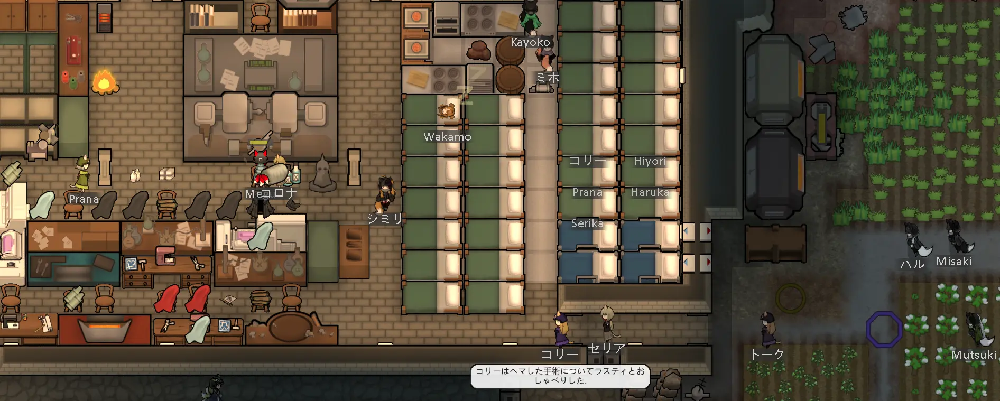

## RimWorldというゲーム

[RimWorld](https://store.steampowered.com/app/294100/RimWorld/)は、Ludeon Studiosが開発したPC用ゲームで、分類するならサバイバルとかワーカーシムとかそういうジャンルに分類することになると思います。

宇宙船の故障で惑星に墜落＝不時着した入植者たちが生き延びるためにコロニーを築いて生活するゲームで、ワーカーシムの名の通り、2Dデフォルメされたワーカーがちょこまかと自律的に動き回りつつコロニーを形成するので、**プレイヤーは神様というか守り神とかそういったポジションから様子を眺めたりあるときは指示を与えたりしながらそのコロニーの行方を見守るというそんなゲーム**です。自律的に動き回るってのがミソで、僕はプログラマーなので決められたスケジュールと作業優先度に従って仕事をし食欲を満たすために食事を取り眠くなれば睡眠をとり会話をして友好的な関係を築くこともあれば、喧嘩をすることもあるワーカーが好き勝手ワチャワチャ動き回りながらコロニーというシステムを構成する様子を眺めるのがぶっ刺さった感じです。他のゲームに例えるのがちょっと難しいんですよね。

  

  

  

気づいたかもしれないですが、この記事中でスクショを撮るために作成したセーブデータでは、ワーカーの名前をほぼ全てブルーアーカイブというゲームの登場人物から取っています。数が多くなってくるとどれがどういう事が得意かとか覚えづらくなってですね……。

# この記事を書いた理由

僕はこのゲームを友人の勧めで2019年8月に購入し、2024年11月時点で延べ1,973時間プレイしている**Rim星人**です。約5年間、1ヶ月あたりに換算すると30時間、つまりこの5年間で1日1時間欠かさず遊んでいる計算ですね、ホントかよ。

もちろん仕事や他の趣味で遊べない時期もあったはずで、それを考慮すると実際にプレイしていた期間中の1日あたりのプレイ時間はおそらく5時間を超えるはず。RimWorldをプレイしているときの僕は仕事・睡眠・食事・風呂以外の時間を全てRimWorldに注ぎ込んでいて、それこそ風呂にPCがあれば風呂に入りながらRimWorldをやっているであろうし、睡眠しながらRimWorldを遊べる未来の素敵なガジェットが存在するならば、寝ながら遊んでいることは疑いないです。

僕のゲーム仲間にもRim星人は多数存在し、プレイ時間が長いやつはゆうに**12,000時間**に迫っている。ちなみに12,000時間とは、食うや食わずどころか寝ずに**499日間24時間ぶっ通し**で遊んだ場合の時間。一日の半分をプレイに費やしたとしても、3年間近くかかる計算です。

記事を書くにあたって数字にしてみたけどえげつない数字ですね。大学受験をガチでやった高校生の勉強時間と同じぐらいですかね。そう考えると大したことがないような気もします。げに人間の時間間隔の相対的たるや。

ちなみに生きた時間に応じて時間感覚が変化する、歳を取ると1年が一瞬よねえ、みたいなアレですが、**それを考慮すると人生の折り返し地点は20歳ごろ**だそうです。あなたは人生の折り返し地点の手前ですか？後ですか？折り返し地点を過ぎてからどれぐらい過ぎましたか？やめましょうかこの話。

ただし、こうした**高位のRim星人**たちを悪く言うつもりは全く無くて、彼らの存在があるからこそ、僕は「自分はRim星人だがRim廃人ではない」と胸を張って~~言い訳~~主張できるわけです。彼らにはぜひ今以上に研鑽を積んでもらい、20,000時間の大台を目指して欲しいところ。いやーほら、12,000時間遊んでる人がいるんだから2,000時間しか遊んでない僕がもう1日ぐらいRimWorldのプレイで無駄にしてもいいじゃん？みたいな。そういうことです。

# 時間が溶ける

ここまで読んでもらえたならわかると思いますが、このゲームは危険なゲームです。僕の仲間うちでは、RimWorldについてこんなジョークが存在します。

> 「このゲームを買ったら、まず設定で現実の時刻をゲーム内に表示するオプションをONにしろ」

いや本当に、RimWorldを起動していると時間があっという間に溶けるんですよね。ゲームを終了するタイミングがないというべきか。金曜の夜にプレイを始めたが最後、土曜の昼に買い物に行こうと思っていた予定が吹き飛び、気づけば日曜の夜。挙句、トイレに行く回数を減らし、食事も睡眠も取らず、朦朧とした頭で月曜の始業を迎える──そんな経験が何度もあっちゃ困るんですが何度もあります。

一時期、**ResonanceAge**や**Phantasy Star Online 2**、**Final Fantasy 14**といったMMORPGにハマっていた時期もありますが、RimWorldはそれを凌駕してます。むしろFF14については、RimWorldを起動しながらシャキ待ちしていた記憶すらあります。結局シングルプレイヤーゲームなので、他の物事に干渉しないのが良いんですよね。プレイ中にちょっとYouTube見たくなったら起動しながら見ればいいし、友人からモンハンのマルチに誘われたら起動しながら参加すればいいし、プレイ中に始業時間になったら起動しながらリモートで朝礼に参加すればいいです。もちろん最後のは冗談です。ほんとほんと。これが嘘をついている人間の目に見えますか？

RimWorldがこれほどまでに時間を吸い尽くす理由は、最適化を追い求めても終わりが見えないことに尽きると思います。コロニーの強化を繰り返し、その結果生まれる新たな課題に対処しているうちに、いつの間にか時間が経っている。最適化を繰り返す最中に最適化の余地が生まれるという悪循環がゲームデザインから担保されているのでたちが悪いです。

最近まで、自分はプログラミングが好きだからこのゲームにハマったのだと考えていたんですが、プログラミングの知識が全くない知人がこのゲームにどっぷりハマっているケースもあるので、おそらく凝り性や潔癖症といった性格の人が特にハマりやすいゲームなのかなと思います。なのでこの記事を読んでるちゃらんぽらんでぐうたらなアナタ、RimWorldにハマる要素が全く無いので騙されたと思ってちょっと遊んでみてください。平気平気、ダイジョブダッテ！

# あなたもわたしもRim星人

なぜ僕はこの記事を書こうと思ったのかというところを振り返ってみます。**アークナイツ**のデイリーを放り出してアドベントカレンダーの枠を取り、VSCodeでMarkdownファイルを作成したのは金曜日の深夜2時でした。

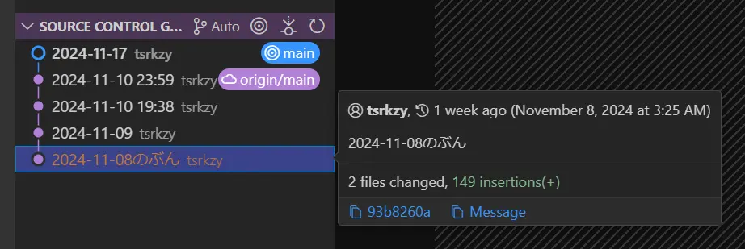

テーマに困ってアドベントカレンダーの参加に躊躇していたのは事実ですが、どうしてこんな食いつきの悪そうなテーマで長文記事を書く気になったのか自分でも不思議です。よく考えればもっと他に適したテーマがあったはずなんですけどね。「2024年版僕の買ってよかった家具・ガジェットランキング」「コンビニ:まいばすけっとのおすすめ冷凍おつまみ」「アークナイツの推しオペレーター」「去年寿命で天に召された飼い犬の写真と思い出」とか、少なくとも、これらのテーマならもっと多くの人に読んでもらえるんじゃねって思います。特にひとつめとふたつめに関しては誰かが書いてくれたら絶対読む。

### 自問してみる

じゃあなんでRimWorldの記事を書いたのか。

> プレイ人口や同志を増やしたい？  

一応紹介記事の形を取ってますが、正直この記事読んでこんな古臭いPC用ゲームやってみよう！って人いないと思うんですよね。それにこんなおひとり様用ゲームで他人はノイズだと思います。コロニーを見せ合ったりMODについて語ったりするのは楽しいけど、それならDiscordやSteamのコミュニティ、Redditで事足りるし。  

> 知識をひけらかすことで自己承認欲求を満たしたい？  

前述しましたが、RimWorldの2,000時間プレイは特別なものではなくてむしろ平均的なプレイ時間で。それにこのゲームは攻略サイトや動画が充実しているので、いまさら薄っぺらな攻略記事を書いても底の浅さがすぐ露呈してしまうので、それも違うかなって。

> 他人に影響を与え、自己効力感を得たい？  

これが一番可能性が高そうですが、それにしてもこのテーマで？って感じがします。前のセクションで挙げた他のテーマのほうが広範囲にアピールできそう。

例えば、[まいばすけっと](https://www.mybasket.co.jp/)のおすすめ冷凍おつまみ。2024年版なら[肉付きヤゲン軟骨焼きと砂肝塩焼き](https://item.rakuten.co.jp/beisia/4573502870144/)が最強だと思いますんで、近所にまいばすけっとがあるならぜひ試してみてほしいです。缶コーヒーとかお茶のペットボトル買うついでについ買っちゃう。冷凍食品のくせに常温で解凍して食べられるのも高得点です。これこそUXを重視したデザインというやつだと思います。

### 答えはわからない

結局のところ理由はわからずなので、書いちゃったという表現が適切だと思います。あえて理由をつけるなら、**宇宙的な意思**というやつかもしれない。  

だから、この記事を最後まで読もうと決意した不運な主人公であるあなたにも、ある種の運命が待っているのかもしれない。この文章を読んでRimWorldにのめりこんでしまう人に、H.P.ラヴクラフトの「インスマスを覆う影」の主人公が辿る運命が重なる。あの話で主人公は、自分の中に流れる異形の血に気づき、抗うことなく受け入れてしまうけれど。

初めてプレイする時点では、まさかこれほどまでに時間を吸い取られるゲームだとは思わない。しかし、気づけばコロニーの最適化にのめり込み、膨大な時間が溶けていく。プレイヤーが抗おうとするほどに、ゲームはその本質的な楽しさで引きずり込む。RimWorldにハマるというのは、ディープワン――ではなく、**Rim星人**としての自分を受け入れるようなものかもしれない。

僕はゲーム仲間ほぼ全員にこのゲームを布教したけど、Rim星人に転化したのはごく一部だった。その一部の彼らは、今日も幸せそうに口からよだれを垂らしながらDiscordに知見を投げつけている。  

> 大丈夫、このゲームは巷で言われているほど危険ではない。  
> 一部の人間はRim星人になるかもしれないが……君は**もちろん**健全な体質だろう。  

# 世界観 = 荒廃した惑星と発達した科学技術

RimWorldの舞台は、惑星間航行が可能になった未来。高度な科学技術が存在する一方で、舞台となるのはその恩恵が届かない、銀河の片隅に打ち棄てられた**辺境の惑星(RimWorld)**です。

物語は、宇宙船の故障によってこの惑星に不時着した入植者たちから始まります。そして、彼らを生き延びさせるという苛酷な試練が始まります。

この惑星は決して穏やかな場所ではありません。惑星システムを管理するAIは狂い、制御を失ったドローンが精神波を垂れ流して入植者たちを精神的に追い詰める。さらに、生産や治安維持のために設計されたはずの機械生命体が、人間を敵とみなして襲いかかります。

人間たちもまた味方ではなく、コロニーを襲撃する宙族(raider)、他部族を食料とする食人族(cannibalist)、帝国の特権階級、正体不明の存在を崇拝する狂信者たち……彼らの存在は、入植者を脅かすに十分なものです。

自然もまた苛烈であり、寒波や熱波は突然襲いかかり、火山灰が空を覆えば農作物は壊滅。放射線降下物(fallout)が降り注げば、生き物は次々と命を落とします。  

要するに、この世界は**ニンジャスレイヤーのネオサイタマとパラノイアTRPGのアルファ・コンプレックスを足して荒廃度を倍増させたような惑星**です。有名なオープンワールドゲームであるKenshiの世界観とも共通するところがあるかも。プレイヤーは、この過酷な環境で入植者たちを生き延びさせるという無理ゲーに挑むことになります。

# ゲームスタイル

RimWorldは、コロニーシミュレーションゲームの中でも特に影響力の大きいタイトルです。そのゲームデザインは、後に続く数多くの同ジャンル作品に影響を与え、その多くがRimWorldの設計思想を継承しています。いやね、このゲームを遊ぶと、別のシミュレーションゲームを遊んだときに気づくんですよ。「これRimWorldでやったところだ！」って。まさにコロニーシミュレーションゲームの進研ゼミ。Magic: the Gatheringを遊んだことのあるトレーディングカードゲーム・プレイヤーが他のTCGを遊ぶときに感じるようなアレです。ああアンタップね。ああクリーチャーね。ああカウンターね。ああトランプル持ってんのね。ああソーサリータイミングだけなのね。的な。

RimWorldには「ピクミン」や「Ratopia」のようにプレイヤーが直接操作する主人公的なユニットは存在しません。プレイヤーはコロニーそのものの集合的な意思として行動の優先順位を設定し、大まかな指示を与え、コロニーを導きます。入植者たちはそのルールに従って自律的に動きながら、日々の作業をこなします。ときには、様々な内的・外的要因でプレイヤーの予想を超えた行動を取ることも。

資材を集め、農作物を育て、住居を建てるといった基本的な生活から始まり、脱出用ロケットを建造するための技術研究や、襲撃者に備えた防衛設備の構築に至るまで、プレイヤーが整えた仕組みの中でワーカーは自律的に行動します。ここがこのゲームのキモで(といってもキモが6個ぐらいあるけど)、ユニットの得意不得意や特色に合わせて作業を割り振ることになります。

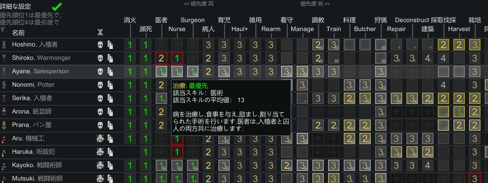

この「行動優先順の管理」が若干プログラミングライクな操作で、どの行動を誰に割り当てるか、どの設備をどこに設置するかといった細かい最適化を繰り返すことで、コロニー全体が自律的に動き始めます。それが気持ち良い。何もしなくて良くなるというか、自分がやることが減るというか。でも決してゼロにはならないというか。その塩梅が絶妙なゲームです。

# 心情とメンタルブレイク

RimWorldに登場する入植者たちは、それぞれが心情(mood)という精神状態を示すパラメータを持ってます。この心情が極端に低下すると、彼らはメンタルブレイク(mental break)という形で発狂します。要するに**クトゥルフTRPGの正気度と一時的発狂ですね**。   

メンタルブレイクは、プレイヤーにとってコロニー運営の大きな障害になる存在で、例えば長期間空腹が続いたり、睡眠不足や友人の死が原因で精神状態が悪化すると発生します。また、生活空間の汚れや敵の死体の放置も、心情を大きく損なう要因になります。このゲームは変なところがリアルなので、戦闘で敵を殺害するとその死体が残ります。焼却するなり埋めるなりして処理する必要があり、ほっとくと腐ります。腐った死体を目にした入植者の心情低下は酷いです。

メンタルブレイクにはさまざまな種類があって、比較的穏やかなものとしては、物にあたる、引きこもる、泣きながら徘徊するとかですね。一方で深刻なものでは薬物乱用、放火、さらには他の入植者への暴行や殺害なんかも発生します。読んでわかると思いますが、殺害なんかは致命的です。このゲームは入植者同士が恋人になったりするので、恋人を殺した犯人に対しては友好度が下限の-100に固定されます。よくもあたしのタケちゃんを！ってことですね。誰だよタケちゃんって。もし読んでる人の中にタケちゃんがいたらごめんなさい。そうなると殺害犯はコロニーで孤立し、さらに心情が悪化してまたメンタルブレイクを起こしたりします。楽しいゲームですね。

プレイヤーは、これらの問題を未然に防ぐために様々な対策を講じる必要があります。死体の速やかな火葬処理。汚染物の適切な処理。コロニーの内装デザインの改善。なんで僕がお前らのご機嫌取りをせにゃならんのだという感じはしますが、そうしないとひどい目に遭うので仕方がないですね。入植者の性格によっては他の入植者より部屋が広くて豪華じゃないと心情が悪化するとか、いやいや部屋は土床じゃないと心が痛むんですとか、定期的に処刑しないとテンション下がるとか、人肉食べないと気が済まないとかやべーやつばっかです。そういうやべーやつをコロニーに勧誘しないようにするという選別が重要だったりします。

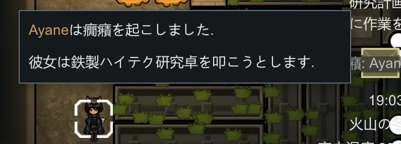

# RimWorldの遊び方

実のところ、この記事を読んで「**RimWorldやってみたい！**」と思ってくれた方がいたとしても、嬉しさと同時に、それ以上の質量の不安を感じてしまう。   

何を隠そう、このRimWorldというゲーム、UIや操作性は素朴で洗練されておらず、ゲームデザインはハードコアであり、難易度は初心者殺しなのである。デモ版(無料版)は存在しないため、ゲームの核心部分にふれる前に心を折られて「せっかく買ったけど合わなかった」とSteamの返金機能を使って返金してしまうプレイヤーが後を絶たないのである。こちらとしても、せっかくこの記事という毒酒を呷ってくれたのだから、飲んだ後に「ああ、美味しい酒だったな、**こんなにきれいな幻覚が見えるようになった**」と言ってもらえるような、そんな記事を書きたいところだ。

というわけで、スムーズにRimWorldに墜落できるようにガイド記事を書いていく。攻略記事のような突っ込んだものではなく、他のゲームと比べてどういった違いがあるので最初はこうしたほうがいいよ、というような内容にするつもりである。   

この記事読んでいる途中でRimWorldを早速起動したくなる人もいるかもしれないので最初に結論を言うと、**プレイ難易度は下げ、攻略情報が見たければどんどん見て気負わずに遊んで欲しい**というところだ。

## 洋ゲー特有の難易度とUI

RimWorldの特徴として挙げられるのが、**自由度の高さ**と**厳しいゲームバランス**である。裏を返すと、高い自由度故に初心者は何をしてよいかわからず、多くの初心者は「なぜこのゲームが世界的に評価されているのかわからない」と感じてしまう。特にUIの分かりにくさや、ゲーム序盤の厳しさは多くのプレイヤーが壁に感じる部分だ。

例えば、他のゲームに例えるならば以下のようなものだろう。

- クラフトなどの基礎的な操作方法が全く説明されない状態で始まる、難易度ハードのマインクラフト
- ロックオン機能の説明が不十分なまま、異常に強いチュートリアルボスのヘリコプターと戦わせられるハイスピードロボアクション

最近のアップデートでチュートリアルが多少親切になったものの、それでも難しいことには変わりがない。

### 難易度は柔軟に調整しよう

RimWorldのゲームデザインは、ゲームデザイナーのTynan Sylvester氏が「RimWorldはストーリージェネレーターであり、コロニーの全滅や入植者の理不尽な死もゲームの一部」と述べているように、乱数による事故や、プレイミスによるコロニーの崩壊もゲーム体験の一部として受け入れて欲しい、というスタンスだ。しかし、初心者にとってはその理不尽さが挫折の直接的な原因となる可能性がある。昨今の死にゲーに慣れた人でも、天塩にかけて作成したコロニーが悪天候や敵の襲来、疫病の蔓延や1回の判断ミスで台無しになるのを見るのはつらいだろう。

そういった背景があるため、自分のプレイスタイルに合わせてゲーム難易度を下げることに躊躇しないで欲しい。ゲーム難易度が下がれば乱数の影響は減り、敵の襲撃規模は小さくなり、コロニーが受けた被害の建て直しは容易になる。

### 難易度設定とオートセーブの重要性

RimWorldでは、難易度をゲーム中いつでも変更することが可能だ。また、**オートセーブ機能**を有効にすることで、ミスをしても直前の状況に戻れるため、安心してゲームを進められる。

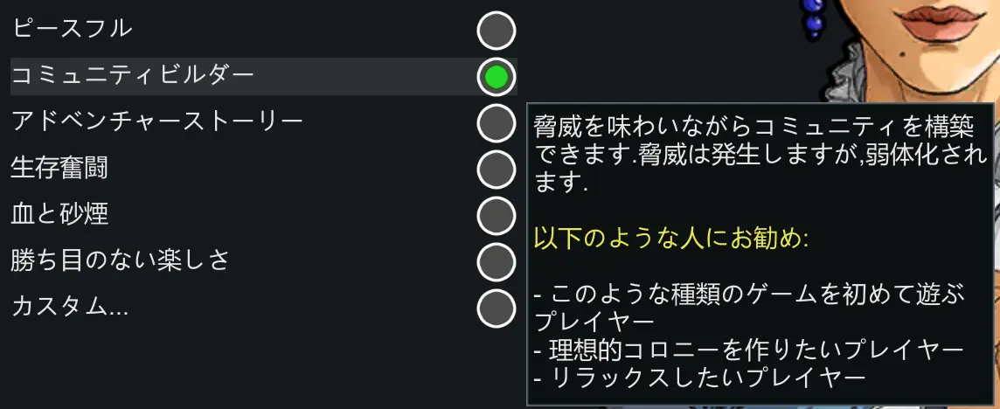

初心者には難易度「コミュニティビルダー」をオススメする。コミュニティビルダーは二番目に易しい難易度であり、僕は普段はコミュニティビルダーかアドベンチャーストーリーを使用して遊んでいる。   

多少うぬぼれてもいいなら、僕は時間の結構な割合をゲームに費やしてきたひとかどのゲーマーであり、RimWorldの高難度モードもなんとかクリアできる腕前の持ち主である。それでも、このゲームは難しい――というか、**非常にシビア**なのだ。   

このゲームの入植者たちは過酷な生存闘争を繰り広げることになる。その過程で四肢を失ったり、あるいは頭部に流れ弾を受けて**即死**したり、死亡せずとも脳へのダメージで**植物状態**になるということもある。前章でも述べたが、このゲームの難易度デザインは、戦場の摩擦の存在を前提としている――すなわち、**戦闘は無傷で終わらない**ようデザインされているのである。これはユニットたちに感情移入してしまうプレイヤーにとって、キツいものがある。

このゲームの負傷は確率で完治せず**傷痕**となり、程度によっては**四肢の欠損**を引き起こす。また、防弾チョッキで胴体を保護していても、頭部に被弾すれば**即死**することもある。それらはゲーム終盤になれば人口義肢や非常に希少なナノマシンシーラム(注入薬)で治療することも可能になるが、それはあくまでゲームに慣れたプレイヤーにとっての話である。

苦楽を共にしてきた入植者の命が、突然無造作に喪われてしまうのは、プレイヤーにとっては非常につらい。「何だこのクソゲー」と罵ってゲームを終了するプレイヤーも沢山いたはずである。   

繰り返しになるが、初心者は「コミュニティビルダー」をオススメする。先ほど、ゲームプレイ中に難易度を変更できると述べたことを覚えているだろうか。そう、**プレイ序盤はコミュニティビルダーで遊び、慣れてきたら難易度を上げてもいい**のだ。   

---

オートセーブの有効化については言わずもがな。数分ごとにオートセーブデータが作成されるので、簡単に巻き戻しを行うことができる。なにかミスをしてしまった事に気づいたら、そのミスを行う前のセーブデータに戻ってしまおう。   

前述の通り、このゲームは意図的に**事故が起こるようにデザイン**されている。それに**対応できるかどうかと、対応したいかどうかはまた別の話**。誰に見られているわけでもなし、自分の楽しみ方を優先していいのだ。

### 戦闘が起きない難易度の是非

> 難易度は下げるべきだというならば、**ピースフル**という一番易しい難易度にすべきではないか？

という意見が出そうだが、これには理由がある。   

**ピースフルでは襲撃というイベントが発生しない。**RimWorldの中でも重要な、敵の襲撃を想定したコロニーを作るという要素をまるまるカットしてしまうことになるのだ。
RimWorldの銃撃戦はタワーディフェンスのようになかなか良く出来ており、このゲームの楽しさを構築する重要な要素となっている。

**極めて小規模だが敵が襲って来るゲーム**と**敵が襲ってこないゲーム**では、プレイ感覚が大きく異なる。コミュニティビルダーならば襲撃は発生し、襲来する敵の規模がやや小さめになるという調整になるため、どのようなコロニーを作れば守りやすいか、どういった箇所がコロニーの弱点になるかを肌で覚えることができるようになるだろう。   

繰り返しになるが、ゲームプレイ中にも難易度は変更できるので安心してほしい。アドベンチャーストーリーで遊んでいたが**襲撃が辛くなってきたのでオプションからコミュニティビルダーに変更する、というようなことも可能**。 逆に難易度を上げることもできるため、歯ごたえがなくなってきたのでアドベンチャーストーリーに変更するということも可能だ。   

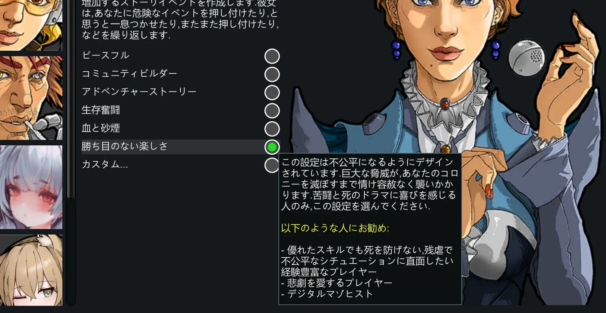

RimWorldはシングルプレイヤーゲームである。誰かに見られているわけでもない。**自分が楽しめる方法を選ぶ**ことが大切だ。難易度調整も、オートセーブの活用も、公式が用意した機能だ。気負わずに使いこなして、RimWorldの世界を存分に楽しんでほしい。

## 攻略動画と攻略サイトとネタバレ

未だに新しいDLCが公開されているためか、RimWorldに関する攻略動画は現在も更新が続いている。プレイしながら攻略動画を視聴すれば、新しいテクニックや面白いMODに出会えることも多く、次々と発見がある。

一方で、「攻略情報を事前に知ることでゲームの楽しみが半減する」と感じるプレイヤーもいるかもしれない。  
以下のような考えを持ったことがある人もいるだろう。

> ゲームシステムやストーリーは、自分の目で見て理解して初めて価値がある。

その意見は理解できるが、RimWorldに関しては心配する必要はない。むしろ、積極的に情報を取り入れることで新たな楽しみ方を発見できるはずだ。

### ストーリーのネタバレを恐れる必要はない

RimWorldの魅力のひとつは、「プレイごとに新しいストーリーが生まれる」という点だ。100回プレイすれば、100回異なる物語が展開する。

そもそも、このゲームには固定されたストーリーが存在しない。エンディングの目標はプレイヤーが選ぶことができるが、その過程はランダムイベントによって構成されるため、毎回異なるドラマが生まれる。そして、エンディングといっても、簡単なテキストと演出が入り、スタッフロールが流れるだけだ。これは開発側がこのRimWorldというゲームに対して「エンディング」というものをあまり重要視していないからかもしれない。

繰り返そう――**RimWorldにおいて、ストーリーのネタバレを恐れる必要は一切ない**。

#### 攻略方法もどんどん調べてしまおう

では攻略方法についてはどうだろうか。以下のような意見が出るというのは想像に難くない。あなたはどう思うだろうか？   

> 効率的なコロニー設計を事前に知ることは、ゲーム体験を損なうのではないか？それはある意味で卑怯なプレイと言えないか？

例えば、バイオハザード2のダイヤル鍵の番号を予めインターネットで調べておき、その番号を調べるプロセスを丸々スキップするのはいかがなものか、という話である。   

その気持ちはわかる。僕も、初見でバイオハザードのプレイをしている横で、スマホ片手に謎解きのネタバレをしてくる人物がいたならば、即座に**シットダウン式ひまわりボム**をお見舞いするところである。   

だが、それについても心配は無用であると言っておきたい。ネット上に公開されている「効率的なコロニー」の設計図面を入手して、それを眺めて**カンニングしながらプレイするのも是である**と考えている。むしろ、熱心にコロニーの構築方法の勉強してるなあ、ぐらいのものだ。

それはなぜか。RimWorldにおいて、**コロニーの建築方法を知っていること**と**それを使いこなせること**は全く別の話だからである。ネットでちょっと攻略動画を見た程度でRimWorldをクリアできるというのは、このゲームを甘く見すぎである。若い方は元気いっぱいでうらやましいどすなあ。

好きなだけネットで調査し、それを自分のコロニーに応用し、その上でRimWorldのストーリーテラーAIが起こす襲撃イベントや気象イベントに叩きのめされて欲しい。RimWorldはそんなにヤワなゲームデザインではないのである。

ということで、いくつか動画を紹介させていただく。   
ぶっちゃけこんな記事なんか読んでいないでこれらの動画を見てもらったほうが話が早いのだが、せっかく書いた文章を自分で否定するのも悲しいので、できればこれらを観るのは読み終わってからにして欲しいところだ。

<iframe width="560" height="315" src="https://www.youtube.com/embed/-qJuFPfuKZo?si=p-5H3Yg5VpKht-2G" title="YouTube video player" frameborder="0" allow="accelerometer; autoplay; clipboard-write; encrypted-media; gyroscope; picture-in-picture; web-share" referrerpolicy="strict-origin-when-cross-origin" allowfullscreen></iframe>

<iframe width="560" height="315" src="https://www.youtube.com/embed/C5jh-eFyEFo?si=Tfg7Tsf1fLfQn5sE" title="YouTube video player" frameborder="0" allow="accelerometer; autoplay; clipboard-write; encrypted-media; gyroscope; picture-in-picture; web-share" referrerpolicy="strict-origin-when-cross-origin" allowfullscreen></iframe>

これは上級者向け
<iframe width="560" height="315" src="https://www.youtube.com/embed/rcilAWODASU?si=1-UErQ_JZDKWIFI2" title="YouTube video player" frameborder="0" allow="accelerometer; autoplay; clipboard-write; encrypted-media; gyroscope; picture-in-picture; web-share" referrerpolicy="strict-origin-when-cross-origin" allowfullscreen></iframe>

有志によりWikiも運営されている。

* [RimWorld Wiki(JP)](https://wikiwiki.jp/rimwikijp/guide#f3049dd8)   
* [RimWorld Wiki(EN)](https://rimworldwiki.com/wiki/Main_Page)   

## 入植者の見た目を変更する

ゲームの内容からはやや離れた話になるが、入植者の見た目を変更するMODを導入することをオススメする。RimWorldの入植者の見た目はデフォルトでは非常に**芋臭い**物となっている。コロニーを構築する入植者とは長い付き合いになる。**好みの見た目に変更するMODは有志によっていくつも作成されている**ので、モチベーション維持のためにも導入することをオススメする。人間の種族として別の種族(例えば狐耳の獣人)を追加するMODもあるので、そういった性癖があるならば、種族の追加も視野にいれるといいだろう。
僕のイチオシは美狐(Miho)というMOD。   
どちらも種族だけでなく武器や建築物が追加されるため、遊びの幅が広がるものとなっている。後述するが、興味があるならば是非導入してみて欲しい。

](./img/0110_default.webp)

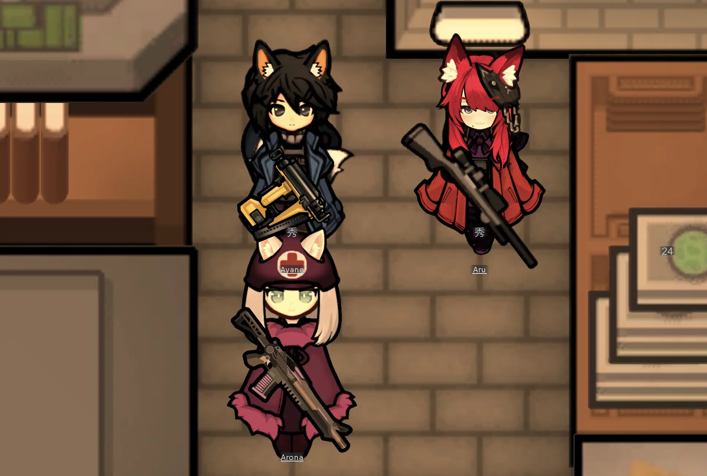

## チートモード

オプションに「開発者モードを有効化」というオプションがあり、それを有効化することで様々な**開発用コマンド**を使用することができる。 いくつか挙げるとこんな感じである。

1. 死亡したユニットの蘇生
2. ユニットが負った不可逆な負傷(四肢の喪失、脳の損傷など)の治療
3. 好きなアイテムの出現
4. 研究の即時完了
5. ユニットがダウンするHPダメージを即座に与える

> ん？ちょっとまって！これって**チート**じゃないの？

**チート**とは、ゲームデータを改ざんあるいはネットワークに介入するなどして、ゲーム内で不正な行為を行うことを指す。対して、こちらは開発者コマンド。**オプションから自由に有効化**することができ、隠しコマンドというわけでもない。広義ではチートと表現しても間違いないかもしれないが、公式機能であるため、もちろん不正行為ではない。

前にも書いたが、このゲームは少しのミスで、あるいは**ミスをしなくても運が悪いと**入植者が理不尽に死亡したり、腕や脚を吹き飛ばされて戦闘能力を失ってしまう事がある。敵として登場したユニットを味方に引き入れることもできるため、**味方として勧誘しようとしたら先程の戦闘で片腕がもげていた**……ということもままある。義肢を装着して機能を回復させることもゲームシステム上可能だが、それができるようになるのは終盤になって、そのための資源を大量に用意したうえでのことである。   

コロニー運営にとってアクシデントはスパイスになりうるが、**不可逆なアクシデントはストレスたり得る**。開発用コマンドで、そういったストレスを和らげることができるならば、特にゲームに慣れていない序盤のうちは積極的に利用すべきだろう。もちろん、開発者モードを使用せずにゲームに真正面から向かい合うハードコアなプレイスタイルを僕は否定しない。

繰り返しになるが、オプションから自由に使用することが可能な**公式機能**である。隠し機能でもなんでもないので、使うことに負い目に感じる必要はない。

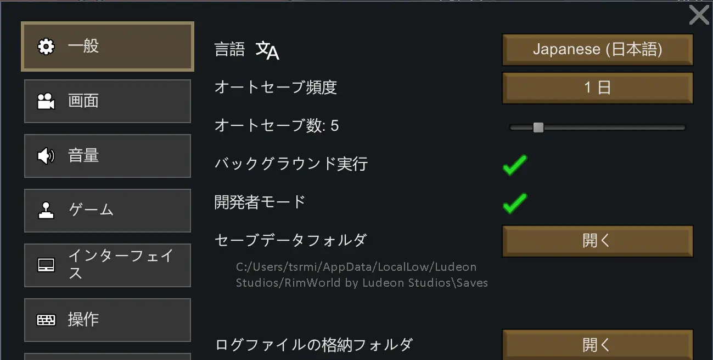

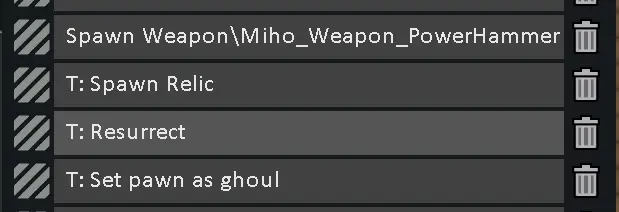

# やり込み要素

このゲームのクリア条件は複数存在する。RimWorldという惑星へ墜落し遭難していた入植者達が、最終的に**星外へ脱出**するというものである。DLCによって追加されるものも含め、基本的なものをいくつか紹介する。

1. 研究を進め、ロケットを作成して脱出する
2. マップ上をコロニーを作りながら移動し、放棄されたロケットの元へたどり着いて脱出する
3. コロニーを発展させ、総資産を一定の金額以上まで稼いでコロニーごと売却することを3回繰り返す

だがもちろん、これらのクリア条件の達成は「MineCraftでエンダードラゴンを倒す」のとほぼ同義だ。**ロケットを建築せず、コロニーを発展させて整備し、定住することも可能**である。これは勝手な想像だが、過半数以上のプレイヤーはこのプレイスタイルに落ち着くのではなかろうか。

### 定住

前項で書いた通り、このゲームには「星外へ脱出する」という目標が設定されている。だが、そこにたどり着くまでの過程をたどると以下のようになる。  

ゲーマーはこの図を見た時点で変な笑いが出るはずだ。勘の良いゲーマーは嫌いじゃないよ。そう、モンスターハンターで強い敵を倒すための強い武器を作るために強い敵を倒す必要があるという例のアレである。

そう、ロケットの建築というクリア目標があるにはある。ただし、大半のプレイヤーはロケットの脱出を目指す最中、**手段が目的と化し**、脱出することを忘れてRimWorldに根を下ろしてしまうのである。
この**コロニー強化ループ**のイテレーション(iteration:繰り返し)こそが、RimWorldを**中毒性**の高いコロニーシミュレーションゲームたらしめている部分なのだ。このイテレーションには以下の要素が含まれている。   

1. 拡大再生産(extended reproduction)
   1. 資材を集める施設で集めた資材で施設を強化してさらに資材を集められるように
2. 生産管理
   1. 必要な資材を必要な数だけ高品質に作成し必要な場所へ届ける
   2. 素材格納庫と生産場所、生産品格納庫の導線を短くする
3. 戦略(strategy)
   1. 接敵するまでに行う戦闘技術
   2. 食料と薬品、修理用資材を整え、迎撃地点を構え、武器を揃えて、戦闘スキルを成長させておく
4. 戦術(tactics)
   1. 接敵してからの戦闘技術
   2. 構築した迎撃地点を活かして戦闘する
   3. 敵は毎回マップの端からやってくるとは限らず、降下襲撃や砲撃にも臨機応変に対応しなければならない

プレイヤーはコロニーの構築を通じてこれらの要素をすべて満たす必要があり、プレイ中はそれにずっと心を砕くことになる。

## 考えることが尽きない

コロニーの建築・増築・改築時に考えていることをつらつら書き出してみた。ここに挙げたものはその一部で、興味がない方には非常に退屈な内容だろう。見出しに **読み飛ばしてOK** と記載したものは、興味がない方はスルーしても問題ない内容である。   

### 距離と動線(読み飛ばしてOK)

物資は生産した後運搬する必要があり、保管しておく場所の確保も必要だ。それを怠れば、入植者達が食事を摂るためだけにコロニーの端から端まで移動する羽目になったり、襲撃が発生したときに迎撃用の装備品を揃えるのに時間がかかり、野盗に防衛ラインを無血突破されることになるかもしれない。   

これを満たすため、アクセス頻度が高い倉庫は基地の中心に置き、生産設備や調理場、宿舎などはその周辺に配置すべきだというのが**RimWorld学会**の通説である。その思想は倉庫を中心に配した円形コロニーとして実装されることが多く、以下の画像はRedditで行われている議論スレッドから拝借してきた説明用画像だ。   

["円を基本とした反復拡張が可能なコロニーデザイン" Infinitely Repeating Modular Circle Base Design](https://www.reddit.com/r/RimWorld/comments/8luo1c/infinitely_repeating_modular_circle_base_design/?rdt=56684)   

### キルゾーン(読み飛ばしてOK)

敵を効果的に迎撃するキルゾーンの形状についても、入植者たちの数、遠隔・近接適正、武器種を考慮する必要がある。キルゾーンを作成する場所も問題で、万一キルゾーンを突破されたときを考えると、最もコロニーに対して被害が出づらい場所の近くにキルゾーンを構築しておく必要がある。   

農業区域の牧草の上で敵の火炎弾を受ければ入植者たちはあっという間に火だるまになるし、燃料庫を背にして戦うのは愚の骨頂。戦闘では負傷者が出ることが考えられるから、速やかに治療を行えるよう、医療設備にある程度アクセスが良いところに構築したほうが良いだろう。   

照明の配置も重要だ。暗闇のユニットには暗所作業というデバフがかかり、行動速度や精度が悪化する。入植者達が行動し、戦闘を行う場所には壁掛け照明や投光器を設置しておくべきだろう。   

Redditからの引用画像ばかりで恐縮だが、ゲームのやりこみ情報は5chはRedditを探すのが一番である。

["近接格闘武器のみを装備したコロニーにおいて最適な、迷宮型を採用し、襲撃者を分散させて近距離のタイマンに持ち込むためのキルゾーン設計" The Melee Killmaze (A killbox for melee colonies)](https://www.reddit.com/r/RimWorld/comments/yklg9u/the_melee_killmaze_a_killbox_for_melee_colonies/)   

ここまで読んでいて面倒くさいと感じただろうか？まだまだある。僕も書いていてつらくなってきた。   

### 戦闘の後始末(読み飛ばしてOK)

敵を撃退したらしたで、その後始末を効率的に行える構築・設定を行っておく必要がある。   

戦死者の死体をそのまま放置しておけば、**人間の死体を見てしまった**という形で入植者たちの心情に悪影響が発生する。戦闘後のリカバリを行うべき重要な時期に入植者たちが**メンタルブレイク**を引き起こしてしまう可能性があるのだ。速やかに死体を火葬処理する準備を整えておくべきだろう。

修理も必要だ。マップ上の生産設備や建築物などは**耐久値**を持ち、流れ弾などを受けると耐久値が減る。可燃性の素材でできた壁は、放火や火炎弾で燃焼して耐久値を失う。耐久値がゼロになった建築物は当然ながら破壊されてその機能を失ってしまう。そのため、キルゾーンの建築物(例えば掩蔽物として使った土のうや壁など)は修理し、**破壊されていたら建築し直す**必要がある。

ユニットが死亡すると、それが所持していたアイテムが付近に散らばる。それらを放置しておくと、キルゾーンの機能に影響が出ることもあるし、何よりそれらは重要な資源だ。**食品や薬品は回収**し、**武器類は鋳潰して金属資源へ変換**しておくべきだろう。遺体が身につけていた衣服には、残念ながら**穢れたもの**という属性がついてしまい、入植者たちはそれを着るのを避ける。もったいないが、衣類については燃やしてしまうのが賢明だろう。

## 自動化

そろそろうんざりしただろうが、健全で効率的なコロニーの運営を行う上で考慮すべきことは、ここに記載したもの以外にも大量にある。ただ、**プレイヤーはこれらをすべて手動で行う必要はない**。前述の通り、RimWorldは入植者の行動をある程度プログラミングできるので、これらの設定を組み合わせることで、ここまで書いた処理をほとんど自動化することができるのだ。   

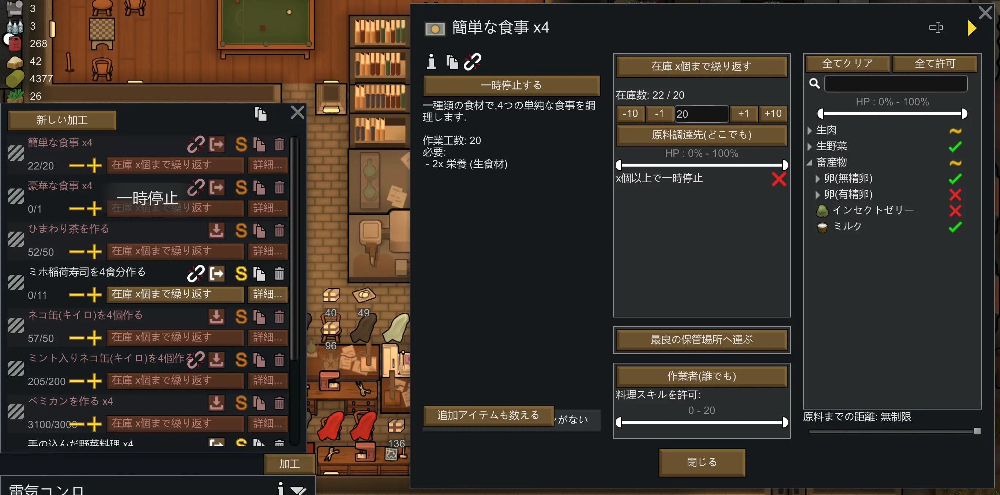

# 出来上がったコロニーを眺めながら

これらの設定と優先順位付けが適切に行われたコロニーは、一つの**システム**であると言っても過言ではない。まさにその言葉の通りで、これらの条件設定が適切に行われたコロニーを一度構築してしまえば、**プレイヤーが行うのは戦闘モード・通常モードの切り替えぐらい**である。   

なんてよく出来たゲームであろうか。僕は常々、RimWorldを**義務教育のカリキュラム**に取り入れるべきだと考えている。近年、義務教育でプログラミングが導入されたという話を耳にするが、そんな面白みのないものよりこのゲームで遊んだほうがアルゴリズムへの理解、構築力が高まると考えてしまうのは贔屓がすぎるだろうか。   

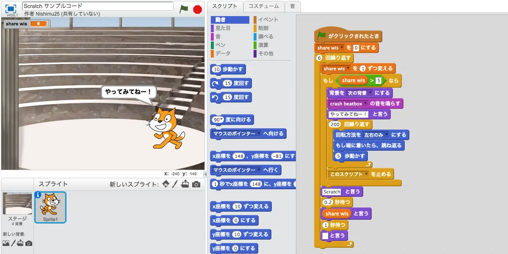

そうして時間に余裕が生まれたら、ランダムに発生するイベントに対して手動で対処し、入植者たちの行動の最適化が甘い部分を見直したり、コロニーの動線がイマイチな部分を模様替えしたり、ちょっとすしすきーのLTLを眺めたり、裏で絵を描いたり、ブログの記事を書いたり(今まさにこの作業を行っている！)すればいい。   

または、ロケットを作って脱出するのだ！という奇特な人は、そのための資材集めを行えばよいのだ。ここまで来ると、やっていることは**構築**ではなく**運用保守**であるから、時間がいくらあっても足りず、やることは尽きない。

## ランダムイベント

コロニーの中で暮らす入植者たちは入植者同士(時には捕虜にした襲撃者)と恋に落ちたり、結婚したり、その後あるいはその前に破局を迎えて発狂したり、落雷に見舞われて火事に遭ったり、疫病に感染したり……仮に**理想的なコロニー**を構築したとしても、その上でプレイヤーを飽きさせないイベントが大量に実装されている。   

例に上げたようにその内容はさまざまで、小は**入植者同士が殴り合いのケンカ**をして負傷するところから始まり、大は火山が大噴火して空が長期にわたって灰に覆われ**氷河期が到来**、農耕が不可となり気温が急低下したりなど、ここですべて紹介するのは不可能なほどの種類が存在する。
それらを絶妙な塩梅で発生させるために**AIストーリーテラー**というゲームシステムが実装されている。それらのお陰で、例えばゲーム開始直後の4人のコロニーにいきなり50人の野盗の襲撃が来たりということは起こらないし、ゲームスタート早々に氷河期イベントが発生し作物も野生の動物も全滅して食料がなくなり詰む、ということも起こらないようになっている。   

AIストーリーテラーが「ゲーム内のコロニーのデータから判断して、これぐらいの脅威が発生しても、**プレイヤーが頑張れば骨折ぐらいで済むだろう**」という計算を行ったうえで、**いい感じ**にプレイヤーを苦しめてくれるのである。   
もちろん、難易度によっては**骨折**が**かすり傷**で済むようになっているかもしれないし、逆に高難易度では対処を少しでも誤れば**致命傷**になることもある。   

また、AIストーリーテラーには**人格**がいくつか用意されており、プレイヤーが選択できるようになっている。主に入植者の心情に打撃を与えるイベントを用意して発狂させることでコロニーにダメージを与えるカサンドラ。イベントの発生周期が長いが一つ一つのイベントの破壊力が非常に高いフェーベ。ランダム性が非常に高く何が起こるかわからないランディなど。

これら以外にもMODでAIストーリーテラーを追加することができるし、難易度と同じく、**ゲームプレイ中にAIストーリーテラーを切り替えることも可能**だ。   
長期間のTRPGセッションのように、GM(あるいはRNG)を定期的に交代させることで、起伏に富んだゲームプレイ体験を楽しむことができる。

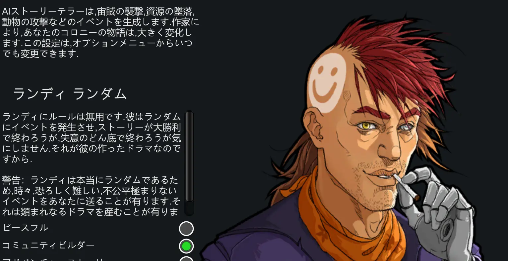

# DLC

RimWorldは現在も開発が続けられており、不定期ではあるが有料DLCがリリースされている。いずれもゲーム内に要素が追加されるもので、導入はプレイヤーの意思に委ねられている。

例えば、Biotechは導入したいが、Royaltyは肌に合わなかったので導入せずにプレイしたい……といった形も可能。DLCごとの特色についても触れていきたいところだが、すべてを紹介するとボリュームがとんでもないことになってしまうので、簡単に説明するだけにとどめておく。   

## Royalty

日本語に直訳すると**王家**であろうか。

RimWorldは開発に失敗した惑星のような荒廃した世界観のため、惑星上の文明レベルはひどいところでは原始時代まで巻き戻っていたり、野生の人間が登場することもある。文明についても然りで、このDLCでは**貴族のような特権階級**と、それに支配される支配階級、さらに中世ファンタジーに出てくる魔法のような、**超能力(Psychic)**という要素を追加するものとなっている。

RimWorldはどちらかというと中世ファンタジーというよりはSF寄りの世界観なので、それらは脳に特殊な機材をインプラントすることで特殊な能力を発現させる事ができる、という形で描画されている。それらの技術は一部の特権階級によって秘匿され、それらの能力を持たない者たちは虐げられ、搾取されている……という形である。   

このDLCを追加しゲームプレイを開始すると、コロニーに不時着した貴族を救出したことでコロニーも支配階級に縁ができ、**貴族としてのし上がっていく**ルートや、支配階級の派閥から超能力の機材を持って逃亡してきた人物を保護して**支配階級と敵対する**ルートなどが追加される。プレイヤーはどちらについても良いし、逃亡者から荷物だけを取り上げて処刑しても良い。全てはプレイヤーに委ねられている。

## Ideology

訳するのが難しい単語だが、追加されるゲーム内容から和訳するならば**思想**だろうか。**戒律**と言っても間違いではないかもしれない。

このDLCを追加すると、コロニー及び入植者それぞれに**イデオロギー**が追加され、コロニーまたは入植者はそれに従って生活を行うことを至上の喜びとするようになる。この場合のイデオロギーとは、例えば以下のような要素の組み合わせである。   

* 奴隷を持つことは良いこと
* 野菜を食することは悪いこと
* ドラッグの使用は良いこと
* 部外者を殺戮することは悪いこと
* 自らの肉体に消えない傷をつけることは良いこと
* 服を着ることは悪いこと
* 人肉を口にするのは良いこと
* 悪人を処刑するのは良いこと

入植者たちはこれらのイデオロギーに従うことで心情を改善することが可能で、当然ながらその逆もあり得る。これらはコロニーを運営するうえでメリットにもデメリットにもなり、RP(ロールプレイ)を重視してこのゲームを遊んでいるプレイヤーにとっては、ゲームプレイの幅を広げるものになるだろう。   

## Biotech

**入植者同士の交配・出産**が追加され、**生殖技術・遺伝子工学**の研究ラインが追加されるMOD。日本語訳もそれらが妥当だろう。   

このDLCがリリースされる前から非公式のMODでは種族の追加などが行われてきたが、このDLCで公式が「人種」という概念をサポートし、立派な体躯を持つ種族や火を吹く能力を持った種族などが追加され、それらを遺伝子工学で生産することが可能となった世界が表現される事になる。

## Anomaly

**上級者向け**。SCPオブジェクトや、クトゥルフ神話の神話生物のような未知の脅威である**存在**と、それにまつわる神話技能を追加するDLC。

ゲームプレイ中に謎の建築物である**モノリス**や不穏な雰囲気をまとった旅行者が訪れるイベントが追加され、それをトリガーとして<ruby>アノマリー<rt>特異現象</rt></ruby>のルートが解禁されることになる。

起き上がる死体、突如コロニーに現れる入植者そっくりのクローン、入植者の意識だけを奪い去る怪物、入植者の心を捕らえて離さない黄金のキューブ。それらには、今までのRimWorldの知識だけでは太刀打ち出来ないだろう。それらの**存在**は捕獲可能で、収容して研究することで新たに禁忌の技術を解放することができる。

詳細をぼかした形での紹介とさせてもらうが、**存在**の研究の果てに、入植者自体が**存在**へと昇華してしまうエンディングも追加される。繰り返しになるが、上級者向けのDLCなので、RimWorldに墜落したばかりのプレイヤーにはあまりオススメできない。導入したうえで無効化しておくか、導入せずにプレイすることをオススメする。

# さいごに

RimWorldへの墜落ガイドと称して、RimWorldを初めて遊ぶ人向けの文章を書いてみた。長くなってしまった。ここまででだいたい2万2千文字と少々。この記事を5本程度書けば10万文字であるから、**ライトノベル**が1本書けることになる。   

RimWorldをネタにしてライトノベルを書くとしたら**異世界転生モノ**ならぬ**異惑星遭難モノ**になるのだろうかと考えたが、個人的な希望としてはそういった漂流モノよりはラブコメが書きたい。具体的に言うと、**吸血鬼が人間に惚れて**しまって、人間を吸血したら眷属にできるから言う事をなんでも聞かせられるので、あんなデートもこんなイチャコラもできるんだよなあ、だけどそれは**解釈違い**なんだよなあ、みたいな健全で可愛い理由で悶々とするラブコメのほうが書いてみたい。惚れられた人間のほうは人間の方で、それを自覚しつつ吸血鬼の方から迫ってほしいが故に誘ってみるものの、やけに**耳年増**だったり抜けていたりで吸血鬼の方が困惑する、みたいなやつだと尚良い。が、文才がある方ではないので、その夢は抽斗の奥にでも仕舞っておこうと思う。

確か中学生だったか高校生だったかはたまた小学生の頃だったか、いずれにせよ多感なお年頃に**吸血鬼のラブコメ**を読んだことがあり、その時から**ファンタジックな生き物と人間のラブコメ**はおもしれえなあと性癖をこじらせてしまった気がする。確か**銀**とか**血**とかなんとかそんな感じのタイトルだった気がするが、僕が学生の頃というのは日清戦争の勝利に日本が沸いていた頃の話であるからして、週刊誌の連載で目にしたのか、妹の本棚から勝手に読んだのか、あるいは病院の待合室に単行本が全巻揃っていたのを読破したのか記憶が定かではない。誰かマンガのタイトルに心当たりがあれば教えて欲しい。   

だが、そのジャンルに興味がある人がいたら、RimWorldのDLCである**Biotech**を導入し、サング・オ・ファージという吸血遺伝子を持つ入植者を核としたコロニーを作ってみてはどうだろうか。   

サング・オ・ファージは定期的に人間の血を摂取しないとペナルティが付くが、その代わりに**超人的な身体能力**を発揮できる遺伝子を持っている。もちろん通常の**人間種の入植者と恋愛関係になることも可能**であるし、その身体能力で戦闘においては俺TUEEEなプレイができること請け合いなので、もし興味があれば試してみてほしい。   

---

違う、そんな話をしようとしていた訳ではない。まとめようと思ったのに話がそれてしまった。

それに最近は[なめくじと人間のラブコメ](https://amzn.asia/d/gPEpwjF)とか[人間をゴミみたいに扱う宇宙人と人間のラブコメ](https://amzn.asia/d/bFde9DC)とかを読んでいるので、紹介するならそっち方面の種族追加MODを紹介するべきだろう。

いや、そうでもなく。

ここまで読んでいただいた事に感謝したい。普段文章を書かない人間が情熱にまかせて書き散らした文章であるから、読むのも大変だっただろうと思う。ChatGPTに指摘を入れてもらいつつ文の長さを切り詰め、差し込み画像を入れてマンガのように飛ばし読みしやすいよう工夫したつもりだが、それでも2万文字を読むのはひと仕事であっただろう。この後はクレジットとMODの紹介である。もし興味があれば最後まで読んでいただけると幸いである。

いや、本当によく書いた。一息ついたら次はどんなコロニーを作ろうか。   

## クレジット

ドキュメントの作成・配信にあたり、以下のツールとサービスを使用した。

1. [pandoc](https://pandoc.org/) (MarkdownからHTMLへの変換)
2. [ChatGPT](https://chat.openai.com/) (文章校正、検索補助)
3. [VSCode](https://code.visualstudio.com/) (Markdownエディタ)
4. [Copilot](https://copilot.github.com/) (文章の校正、CSSコーディング補佐)
5. [sakura](https://oxal.org/projects/sakura/) classless CSS framework
6. [ffmpeg](https://ffmpeg.org/) (webp画像への変換)
7. [Github](https://github.com/) (ドキュメントのホスティング)
8. [GitHack](https://raw.githack.com/) (GithubをCDN化するプロキシサービス)

Author: [@僕@sushi.ski](https://sushi.ski/@僕)   
License: [CC BY-NC-ND 4.0](https://creativecommons.org/licenses/by-nc-nd/4.0/)   
※スクリーンショットなどドキュメント中の画像については、それぞれの権利者に帰属するものとする。   

RimWorldとその制作陣、そして素敵なMOD制作者たちのお陰で、僕は5年間にわたって有意義な時間を過ごすことができたし、今後5年間も遊び続けることができるだろう。Ludeon Studios、Tynan Sylvester氏、そしてRimWorldのMOD制作者の皆様にこのテキストを捧げる。   

2024/11/20 AM01:09 僕 自宅にて

# MOD紹介

便利系MODなども書こうと思ったのだが、この記事の中で紹介した動画の概要欄が詳しかったため割愛した。   
ここでは種族追加とゲーム性を変更するMODを紹介する。   

## Miho(美狐) 種族追加

[Miho, the celestial fox](https://steamcommunity.com/sharedfiles/filedetails/?id=2816826107)   
最近登場した、美しいキツネの種族を追加するMOD。   
独自の研究ラインや装備品、超能力、ストーリーテラーなどがセットで追加されるため、基本セットで遊びなれたプレイヤーにもオススメ。   
自然治癒が低く、運搬能力も低いため、やや初心者向けではない部分があるが、超能力をベースとした戦闘スタイルが楽しい。   

## Kurin 種族追加

1. [Kurin, The Three Tailed Fox Deluxe Edition](https://steamcommunity.com/sharedfiles/filedetails/?id=2670355481)
1. [Kurin HAR Edition](https://steamcommunity.com/sharedfiles/filedetails/?id=2326430787)
1. [Kurin HAR Updated](https://steamcommunity.com/sharedfiles/filedetails/?id=3006078428)

RimWorld1.0から登場し、**RimWorldといえばKurin**と言われるほど人気がある種族MOD。   
開発者が更新を止めてしまったが、ファンによっていくつもforkされ、最新バージョン対応版がいくつも公開されている。   
派生MOD同士は互換性がないため、上記の1、または2と3をインストールするのが安牌だと思う。   

## Hospitality コロニーのホテル化

[Hospitality](https://steamcommunity.com/sharedfiles/filedetails/?id=753498552)

コロニーに訪れる訪問者に対して、宿泊施設や物品の販売を行えるようにするMOD。   
訪問者に対しておもてなしをすることで派閥関係の改善や、入植者の引き抜きが行えるようになる。   

僕はこのMODを導入し、サイコイド麻薬を大量に生産して訪問者に売りさばく<ruby>阿片<rt>アヘン</rt></ruby>窟プレイをしていた。   
遊びの幅が広がるので、未経験のプレイヤーには是非導入してみてほしい。

---

以上。